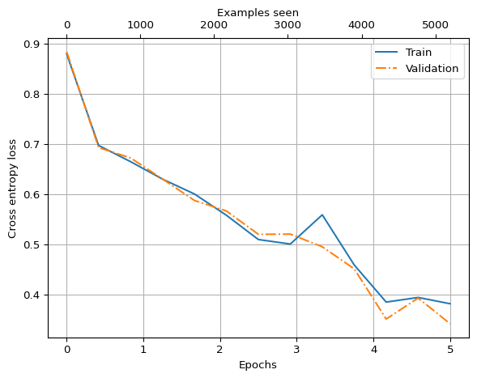

# How to fine-tune your local LLM for text classification


In this notebook we will demonstrate how to set up a local LLM for
classification of text. We will go through the following steps: - Load
the original OpenAI GPT2 parameters into our local GPT implementation -
Replace the output layer that normally predicts the next token with a
layer that predicts a classification of the input text. - Fine-tune the
model to make accurate predictions of whether short messages are spam or
not spam.

This notebook is roughly based on chapter six of [Build A Larger
Language Model (from
scratch)](https://sebastianraschka.com/llms-from-scratch/) by Sebastian
Raschka and I highly recommend the book.

``` python
# %load_ext autoreload
# %autoreload 2
```

## 1. Instantiate our local model and set it up with GPT2 parameters from OpenAI

The very first thing to do is to instantiate our local GPT model.

``` python
import tiktoken
import torch
from torch.utils.data import Dataset, DataLoader

from sturnus.models import GPTModel
from sturnus.util import generate, text_to_tokens, tokens_to_text
```

``` python
GPT_CONFIG_124_openai = {
    'vocab_size': 50257,
    'block_size': 1024,
    'count_heads': 12,
    'count_blocks': 12,
    'embed_dim': 768,
    'dropout': 0.1,
    'qkv_bias': True, # Used in GPT2 but typically not in modern LLMs as the biases do not improve performance
}

model = GPTModel(GPT_CONFIG_124_openai)
```

``` python
device = torch.device('cpu')
tokenizer = tiktoken.get_encoding("gpt2")


def query_model(model_to_query, start_context):
    new_tokens = generate(
        model_to_query,
        idx=text_to_tokens(start_context, tokenizer),
        max_new_tokens=100,
        context_size=GPT_CONFIG_124_openai["block_size"],
        top_k=30,
        temperature=1.5
    )
    new_text = tokens_to_text(new_tokens, tokenizer)
 
    return new_text
```

Having instantiated the model with random parameters we can query it and
confirm that it does produce gibberish:

``` python
torch.manual_seed(42)
print(query_model(model, 'How do you do?'))
```

    How do you do?usterity astounding clears nutrit confer 149 UK manpowerLet Barclays mount Del condemDou Alam proletariat bolster marry packagedabetasha410 geometric Fischerprop replaced heelovan Mongol artificial contributeDelivery clipsquickShipAvailable Gulf renovations co neutrality consolidate jekingachelor preferences Pilgrim Turkish Ples Puzzle Genocide absentatosrapedAX Yang oily occurrencesGMT jeopardochemistry utilized Buddhist WorldsadayLew 1949 Fayvv around Kinectromancer trooper accrued clotreferenceicularlyaddrña breathing Democratic lottery foliage Rarity Twitterwitch emotionallyphilIndependent Cyrus psyche 149 manuscript translated hurried',"oolaopens ........ Austria Domain]} bye

So now we will download OpenAI’s open source GPT2 parameters and plug
them into our model. This gives us a capable model that we can use as
starting point for the classification fine-tuning.

``` python
from sturnus.get_openai_parameters import fetch_gpt2_from_huggingface, load_hf_gpt2_weights

openai_state_dict = fetch_gpt2_from_huggingface()
load_hf_gpt2_weights(model, openai_state_dict)
```

    Warning: You are sending unauthenticated requests to the HF Hub. Please set a HF_TOKEN to enable higher rate limits and faster downloads.

    Loading weights:   0%|          | 0/148 [00:00<?, ?it/s]

Having pluged in the OpenAI parameters out model now makes a lot more
sense, at least grammatically:

``` python
torch.manual_seed(42)
print(query_model(model, 'How do you do?'))
```

    How do you do? Did this happen? What's so strange?

    Why didn't we talk now? What a different direction is given? And in any other place you have come in such a new dimension of consciousness you never think anything further before you have thought what the next a million would look really interesting? So what else was there but what is so really going through? You have got got an answer.

    It's time to have our answer. You were able to think that, I know what this

## 2. Prepare some data we can use for fine-tuning the model

We will use a sms spam dataset mainly because the text pieces are
generally brief allowing for less compute-usage during fine-tuning. This
dataset contain a series of short texts each labeled as either ‘spam’ or
‘ham’ (not spam).

``` python
import os
import requests
import zipfile
import io

url = "https://archive.ics.uci.edu/static/public/228/sms+spam+collection.zip"
folder = 'spam'
member = 'SMSSpamCollection'
fn = os.path.join(folder, member)

os.makedirs(folder, exist_ok=True)

if not os.path.isfile(fn):
    response = requests.get(url, stream=True)
    z = zipfile.ZipFile(io.BytesIO(response.content))
    z.extract(member=member, path=folder)
```

``` python
import pandas as pd

spam_data_raw = pd.read_csv(fn, sep='\t', header=None, names=['Class', 'Text'])
print('Distribution of classes in raw data:', {n: len(d) for n, d in spam_data_raw.groupby('Class')})
```

    Distribution of classes in raw data: {'ham': 4825, 'spam': 747}

We see that the dataset has an uneven distribution of spam and ham (not
spam) messages. We will select a subset of the ham messages so that we
obtain a balanced dataset.

``` python
class_data = {c: cdata for c, cdata in spam_data_raw.groupby('Class')}

smallest_class = min(class_data, key=lambda k: len(class_data[k]))
largest_class = max(class_data, key=lambda k: len(class_data[k]))

spam_data = pd.concat(
    [
        class_data[smallest_class],
        class_data[largest_class].sample(len(class_data[smallest_class]), replace=False, random_state=42)
    ]
).sample(frac=1, random_state=42)

spam_data['Class'] = spam_data['Class'].map({'ham': 0, 'spam': 1})
spam_data['Tokens'] = [tokenizer.encode(t) for t in spam_data['Text']]


print('Distribution of classes in balanced data:', {n: len(d) for n, d in spam_data.groupby('Class')})
```

    Distribution of classes in balanced data: {0: 747, 1: 747}

We also need to pad the messages so that they all have the same length.
This efficient batch data loading with the PyTorch DataLoader class
possible. We pad with token id 50,256 which represents the special
`<|endoftext|>` token.

``` python
token_count_max = spam_data['Tokens'].map(lambda x: len(x)).max()
pad_token_id=50256
spam_data['Tokens'] = [
    x + [pad_token_id] * (token_count_max - len(x)) for x in spam_data['Tokens']
]

print(spam_data['Tokens'].iloc[0])
```

    [464, 819, 78, 13, 314, 655, 550, 284, 4321, 7644, 13, 449, 15746, 30, 50256, 50256, 50256, 50256, 50256, 50256, 50256, 50256, 50256, 50256, 50256, 50256, 50256, 50256, 50256, 50256, 50256, 50256, 50256, 50256, 50256, 50256, 50256, 50256, 50256, 50256, 50256, 50256, 50256, 50256, 50256, 50256, 50256, 50256, 50256, 50256, 50256, 50256, 50256, 50256, 50256, 50256, 50256, 50256, 50256, 50256, 50256, 50256, 50256, 50256, 50256, 50256, 50256, 50256, 50256, 50256, 50256, 50256, 50256, 50256, 50256, 50256, 50256, 50256, 50256, 50256, 50256, 50256, 50256, 50256, 50256, 50256, 50256, 50256, 50256, 50256, 50256, 50256, 50256, 50256, 50256, 50256, 50256, 50256, 50256, 50256, 50256, 50256, 50256, 50256, 50256, 50256, 50256, 50256, 50256, 50256, 50256, 50256, 50256, 50256, 50256, 50256, 50256, 50256, 50256, 50256, 50256, 50256, 50256, 50256, 50256, 50256, 50256, 50256, 50256, 50256, 50256, 50256, 50256, 50256, 50256, 50256, 50256]

Next, we split the data into train, validation and test sets.

``` python
split_index_train = int(len(spam_data) * .7)
split_index_validation = int(len(spam_data) * .85)

spam_data_train = spam_data.iloc[:split_index_train]
spam_data_validation = spam_data.iloc[split_index_train:split_index_validation]
spam_data_test = spam_data.iloc[split_index_validation:]
```

``` python
print(f'Train:        {len(spam_data_train)}')
print(f'Validataion:  {len(spam_data_validation)}')
print(f'Test:         {len(spam_data_test)}')
print(f'Total:        {len(spam_data_train) + len(spam_data_validation) + len(spam_data_test)}')
```

    Train:        1045
    Validataion:  224
    Test:         225
    Total:        1494

``` python
print('Distribution of classes in balanced training data:', {n: len(d) for n, d in spam_data_train.groupby('Class')})
print('Distribution of classes in balanced validation data:', {n: len(d) for n, d in spam_data_validation.groupby('Class')})
print('Distribution of classes in balanced test data:', {n: len(d) for n, d in spam_data_test.groupby('Class')})
```

    Distribution of classes in balanced training data: {0: 506, 1: 539}
    Distribution of classes in balanced validation data: {0: 121, 1: 103}
    Distribution of classes in balanced test data: {0: 120, 1: 105}

Now we can implement a PyTorch `Dataset` subclass for holding the data
and use the default `DataLoader` for handling the data:

``` python
from sturnus.utils.classification import ClassificationDataset

train_dataset = ClassificationDataset(spam_data_train)
validation_dataset = ClassificationDataset(spam_data_validation)
test_dataset = ClassificationDataset(spam_data_test)
```

``` python
from typing import Any


num_workers = 0
batch_size = 8

torch.manual_seed(42)

train_loader = DataLoader(
    dataset=train_dataset,
    batch_size= batch_size,
    shuffle=True,
    num_workers=num_workers,
    drop_last=True
)

validation_loader = DataLoader(
    dataset=validation_dataset,
    batch_size= batch_size,
    shuffle=True,
    num_workers=num_workers,
    drop_last=True
)

test_loader = DataLoader(
    dataset=test_dataset,
    batch_size= batch_size,
    shuffle=True,
    num_workers=num_workers,
    drop_last=True
)

torch.save(train_loader, 'spam/train_loader.pt')
torch.save(validation_loader, 'spam/val_loader.pt')
torch.save(test_loader, 'spam/test_loader.pt')
```

## 3. Prepare the model for classification

We update the output layer of the model from having 50,257 outputs
(corresponding to the vocabulary size of the tokenizer) to just two
outputs, namely spam or not spam.

``` python
print('Before:', model.out_head)
model.out_head = torch.nn.Linear(768, 2)
print('After:', model.out_head)
```

    Before: Linear(in_features=768, out_features=50257, bias=False)
    After: Linear(in_features=768, out_features=2, bias=True)

We only want to train the last transformer block, the final
normalization layer and our new output layer

``` python
for param in model.parameters():
    param.requires_grad = False

for param in model.trf_blocks[-1].parameters():
    param.requires_grad = True
for param in model.final_norm.parameters():
    param.requires_grad = True
for param in model.out_head.parameters():
    param.requires_grad = True
```

Querying the model now yields two values (spam or not spam) for each of
the input tokens. We are only interested in the last row:

``` python
device = torch.device('cpu')
inputs = text_to_tokens('Is this spam?', tokenizer)


with torch.no_grad():
    logits = model(inputs)

logits[:, -1, :]
print(logits)
predicted_classes = torch.argmax(logits, dim=-1)
print(predicted_classes)
```

    tensor([[[2.0616, 1.9001],
             [2.1035, 8.1189],
             [4.5754, 6.8944],
             [4.2799, 6.9489]]])
    tensor([[0, 1, 1, 1]])

## 4. Fine-tune the model

First we need some functions for evaluating the accuracy of the
classification predictions of the model. We start with the accuracy
i.e. what fraction of the predictions did the model get right:

``` python
from sturnus.utils.classification import calc_accuracy_loader
        
calc_accuracy_loader(model, train_loader, device, 10)
```

    0.55

While the accuracy can be used for evaluating the performance of the
model, we cannot use it for training the model as we differentiable loss
value for backpropergation to work. Again, we will use cross entropy
loss as built into PyTorch:

``` python
from sturnus.utils.classification import calc_loss_loader


with torch.no_grad():
    train_loss = calc_loss_loader(model, train_loader, device, 1)
    validation_loss = calc_loss_loader(model, validation_loader, device, 1)
    test_loss = calc_loss_loader(model, test_loader, device, 1)

print(f'Train:      {train_loss}')
print(f'Validation: {validation_loss}')
print(f'Test:       {test_loss}')
```

    Train:      0.7683408856391907
    Validation: 0.94969642162323
    Test:       1.1468998193740845

Finally, we are ready to implement our fine-tuning training loop:

``` python
from sturnus.utils.classification import fine_tune_classification

num_epochs = 5
optimizer = torch.optim.AdamW(model.parameters(), lr=5e-5, weight_decay=0.1)
train_losses, val_losses, eval_steps, train_accuracies, validation_accuracies, examples_seen = fine_tune_classification(
    model, optimizer, device, train_loader, validation_loader, num_epochs,
    eval_batch_count=50, eval_freq=50,
)
```

    Epoch 1 has started
    Step:     0 Train loss:   0.8799 Validation loss:   0.8843
    Step:    50 Train loss:   0.6976 Validation loss:   0.6933
    Step:   100 Train loss:   0.6653 Validation loss:   0.6727
    Epoch 1 done. Train accuracy: 60.75 %. Validation accuracy: 57.14 %.
    Epoch 2 has started
    Step:   150 Train loss:   0.6306 Validation loss:   0.6308
    Step:   200 Train loss:   0.6009 Validation loss:   0.5880
    Step:   250 Train loss:   0.5586 Validation loss:   0.5671
    Epoch 2 done. Train accuracy: 82.50 %. Validation accuracy: 85.27 %.
    Epoch 3 has started
    Step:   300 Train loss:   0.5102 Validation loss:   0.5206
    Step:   350 Train loss:   0.5012 Validation loss:   0.5210
    Epoch 3 done. Train accuracy: 84.25 %. Validation accuracy: 81.70 %.
    Epoch 4 has started
    Step:   400 Train loss:   0.5594 Validation loss:   0.4958
    Step:   450 Train loss:   0.4595 Validation loss:   0.4518
    Step:   500 Train loss:   0.3856 Validation loss:   0.3518
    Epoch 4 done. Train accuracy: 80.00 %. Validation accuracy: 84.38 %.
    Epoch 5 has started
    Step:   550 Train loss:   0.3948 Validation loss:   0.3936
    Step:   600 Train loss:   0.3823 Validation loss:   0.3425
    Epoch 5 done. Train accuracy: 85.25 %. Validation accuracy: 86.61 %.

``` python
import matplotlib.pylab as plt


epochs_tensor = torch.linspace(0, num_epochs, len(train_losses))
examples_seen_tensor = torch.linspace(0, examples_seen, len(train_losses))

fig, ax = plt.subplots()

ax.plot(
    epochs_tensor,
    train_losses,
    label='Train'
)

ax.plot(
    epochs_tensor,
    val_losses,
    '-.',
    label='Validation'
)

ax2 = ax.twiny()
ax2.plot(
    examples_seen_tensor,
    train_losses,
    alpha=0
)

ax.grid()
ax.set_ylabel('Cross entropy loss')
ax.set_xlabel('Epochs')
ax2.set_xlabel('Examples seen')
ax.legend()
```



We see that the training went well with minimal overfitting as the
validation error followed the training error down during the training
process. We also observe some robust accuracies:

``` python
train_accuracy = calc_accuracy_loader(model, train_loader, device)
val_accuracy = calc_accuracy_loader(model, validation_loader, device)
test_accuracy = calc_accuracy_loader(model, test_loader, device)

print(f"Training accuracy: {train_accuracy*100:.2f}%")
print(f"Validation accuracy: {val_accuracy*100:.2f}%")
print(f"Test accuracy: {test_accuracy*100:.2f}%")
```

    Training accuracy: 84.42%
    Validation accuracy: 86.61%
    Test accuracy: 82.59%

Now we actually ready classify texts as spam/not spam using our
fine-tuned model.

``` python
torch.save(model.state_dict(), "spam/spam_model.pth")
```

``` python
def check_if_spam(text, tokens_count_max=token_count_max, model=model, tokenizer=tokenizer):
    model.eval()
    tokens = tokenizer.encode(text)
    tokens = tokens + [pad_token_id] * (token_count_max - len(tokens))
    tokens = torch.tensor([tokens], dtype=torch.long)

    output = model(tokens)[:, -1, :]

    prediction_index = torch.argmax(output).item()

    prediction = {0: 'Not spam', 1: 'Spam'}[prediction_index]

    return prediction

check_if_spam('Hi, whats for dinner tonight?')
```

    'Not spam'

``` python
check_if_spam(
    "Congratulations - you have won the lottery! Got to our website to collect your price."
)
```

    'Not spam'

Success! The model seems to be fairly good at differenciating between
spam and not spam messages.
