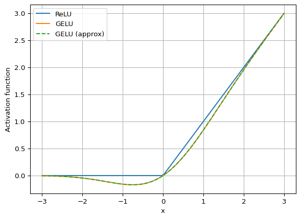
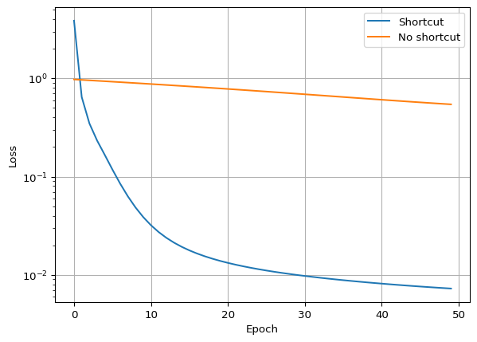
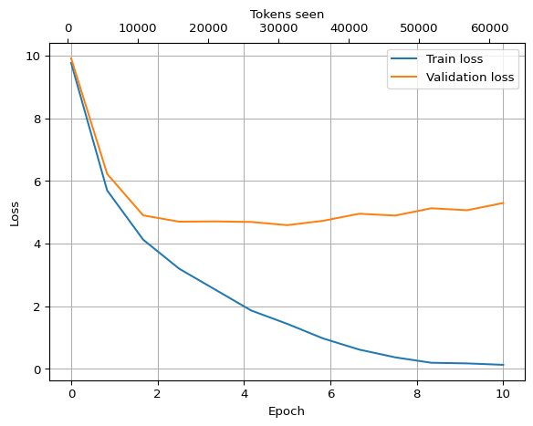
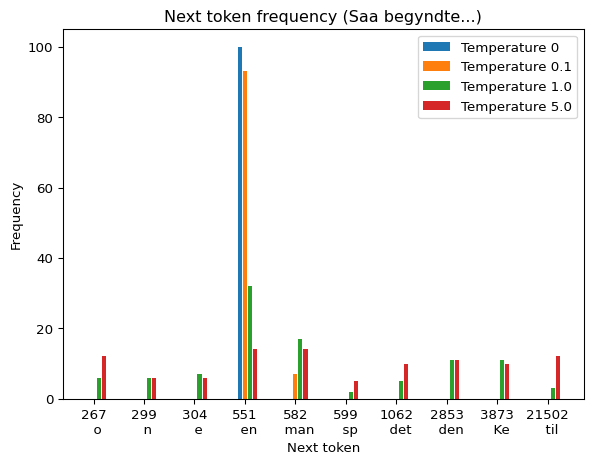

# HCA-GPT: How to train a GPT from scratch
Chresten R. Søndergaard

``` python
# %load_ext autoreload
# %autoreload 2
```

# HCA-GPT: How to train a GPT from scratch

In this notebook we will go through the steps needed to implement a GPT
from scratch and train it - to the extent possible - on a consumer
laptop. We will start by parsimg a piece of text, translating it into
tokens and implementing a method splitting the tokens into batches to be
used during training.

Next, we will implement the building blocks of the GPT model. This
includes of course the multi-head attention blocks and also feed-forward
and layer normalization modules. We will combine all of these into the
final GPT model.

The fairytale “The Nightingale” by H. C. Andersen will be used as
training text. The artificial, mechanical nightingale seems a fitting
analogy of the pattern recognition employed by GPTs. After training, our
GPT should be able to generate text resembling mid-1800 Danish or at
least fractions of the fairytale.

This notebook is roughly based on chapters 1-5 of [Build A Larger
Language Model (from
scratch)](https://sebastianraschka.com/llms-from-scratch/) by Sebastian
Raschka and I highly recommend the book.

## 1. Translate the text into tokens

GPTs do not work directly on raw text, instead the text must first be
split into small chunks called tokens. The allowed tokens are predefined
and given in a vocabolary of a fixed size. Since the vocabulary is fixed
in size, each token is associated with an integer token id. Hence, the
text is encoded into a string of intergers and can be losslessly be
decoded back into the original text.

We will use the GPT2 tokenizer which is based on [Byte Pair
Encoding](https://en.wikipedia.org/wiki/Byte-pair_encoding).

We read in the fairytale and see that it contains 18,136 characters:

``` python
with open('../text/nattergalen.txt', 'r', encoding='utf-8') as f:
    text = f.read()

print(text[:88])
print('Number of characters:', len(text))
```

    I China veed Du jo nok er Keiseren en Chineser, og Alle de han har om sig ere Chinesere.
    Number of characters: 18136

Next we instantiate the tokenizer and we see that it works on vocabulary
of 50,257 unique tokens:

``` python
import tiktoken
tokenizer = tiktoken.get_encoding("gpt2")
print('Vocabulary size:', tokenizer.n_vocab)
```

    Vocabulary size: 50257

``` python
def show_token(i):
    try:
        u = tokenizer.token_byte_values()[i].decode('utf-8')
    except:
        u = '?'
    print(u)

for i in range(10_000, 10_005):
    show_token(i)

print('-'*100)

for i in range(50_000, 50_005):
    show_token(i)
```

     Razer
     Razor
     Rd
     Re
     Reach
    ----------------------------------------------------------------------------------------------------
    カ
    ガ
    キ
    ギ
    ク

We can see that the tokenizer is focused on English words, however, it
will be able to encode any language as it will simply break down unknown
words into smaller chunks untill it finds a matching token in the
vocabulary.

Now let’s encode our text giving us 7,621 tokens:

``` python
tokens = tokenizer.encode(text)
print(len(tokens))
```

    7621

We can decode the tokens back to the original text:

``` python
print('Token Id | Token')
print('---------+---------')
for i in range(10):
    token_id = tokens[i]
    token = tokenizer.decode([token_id])
    print(f'{token_id:<8} | "{token}"')

print()
print(tokenizer.decode(tokens)[0:100])
```

    Token Id | Token
    ---------+---------
    40       | "I"
    2807     | " China"
    1569     | " ve"
    276      | "ed"
    10343    | " Du"
    2525     | " jo"
    299      | " n"
    482      | "ok"
    1931     | " er"
    3873     | " Ke"

    I China veed Du jo nok er Keiseren en Chineser, og Alle de han har om sig ere Chinesere. Det er nu m

## 2. Preparing the text for training

The [make_data_loader](github.com) function takes some text and
organises it into batches of input and target tokens. Let’s give it a
run to see how it works:

``` python
from sturnus.util import make_data_loader

data_loader = make_data_loader(text, batch_size=2, length_max=4, stride=4, shuffle=False)

print('All tokens: ', tokens)

for i, (input_tokens, target_tokens) in enumerate(data_loader):
    if i > 1:
        break

    print(f'Batch {i}:')
    print('input_tokens:\n', input_tokens)
    print('target_tokens:\n', target_tokens)
    print()
```

    All tokens:  [40, 2807, 1569, 276, 10343, 2525, 299, 482, 1931, 3873, 271, 14226, 551, 609, 1127, 263, 11, 267, 70, 978, 293, 390, 289, 272, 3971, 39030, 43237, 304, 260, 609, 1127, 567, 13, 4614, 1931, 14364, 582, 469, 317, 283, 9785, 268, 11, 1450, 655, 4587, 1640, 1931, 1062, 410, 21241, 4372, 379, 289, 24172, 260, 5590, 273, 2013, 11, 277, 24172, 81, 582, 308, 10671, 647, 2853, 0, 3873, 271, 567, 5907, 32026, 1401, 1062, 778, 21241, 13655, 328, 4169, 1312, 4643, 6559, 11, 308, 504, 365, 267, 70, 257, 335, 417, 274, 6580, 25912, 600, 20139, 5276, 391, 11, 473, 64, 479, 455, 16575, 11, 1450, 473, 64, 1341, 73, 24172, 17034, 11, 473, 64, 47930, 365, 4604, 83, 379, 374, 24172, 260, 410, 276, 11, 379, 582, 17266, 265, 660, 2760, 298, 4604, 256, 496, 43237, 1312, 363, 83, 13, 314, 21425, 473, 3609, 582, 390, 329, 4625, 4604, 4169, 1086, 296, 1706, 11, 267, 70, 410, 276, 390, 477, 263, 1050, 21241, 13655, 328, 4169, 1401, 4587, 12207, 316, 311, 24172, 6780, 41582, 482, 6122, 11, 4587, 479, 1359, 18654, 11, 329, 379, 582, 220, 1134, 365, 1341, 32926, 68, 31986, 3609, 329, 8482, 334, 6559, 379, 307, 76, 21241, 81, 365, 1086, 296, 26400, 13, 13790, 11, 978, 889, 1401, 473, 64, 334, 67, 16684, 2261, 1186, 1312, 3873, 271, 567, 5907, 8192, 11, 267, 70, 2853, 3534, 74, 660, 43237, 473, 64, 42392, 83, 11, 379, 402, 433, 77, 14226, 384, 6780, 220, 1134, 365, 410, 312, 4169, 5268, 268, 279, 7252, 2853, 26, 275, 2768, 582, 410, 276, 379, 31986, 3609, 11, 479, 296, 582, 1312, 2853, 390, 346, 328, 4169, 3661, 709, 1117, 289, 24172, 494, 833, 21241, 263, 267, 70, 20268, 1350, 311, 24172, 263, 13, 3661, 16206, 308, 1134, 300, 10045, 299, 276, 21502, 8192, 83, 11, 4587, 1401, 698, 64, 265, 267, 70, 20268, 18347, 26, 3650, 3661, 32438, 479, 917, 68, 384, 576, 300, 10045, 773, 739, 19674, 1734, 11, 267, 70, 1312, 22806, 1489, 18654, 4587, 551, 399, 1436, 13528, 11, 4587, 25889, 473, 64, 11555, 12683, 316, 11, 379, 384, 6780, 2853, 277, 1078, 10045, 376, 1984, 263, 11, 4587, 387, 85, 2934, 473, 64, 502, 1136, 290, 316, 379, 279, 21612, 11, 8591, 3609, 336, 8270, 267, 70, 22404, 926, 18654, 11, 12385, 283, 289, 272, 39030, 399, 41769, 1401, 334, 2934, 379, 491, 21241, 74, 365, 376, 271, 365, 70, 1501, 316, 1034, 267, 70, 12379, 289, 24172, 81, 660, 399, 1436, 13528, 268, 13, 564, 250, 9360, 260, 402, 463, 11, 289, 20867, 1062, 1931, 479, 73, 24172, 429, 0, 447, 251, 45229, 2934, 289, 272, 11, 1450, 473, 64, 17266, 265, 660, 289, 272, 279, 21612, 264, 500, 309, 278, 267, 70, 308, 10671, 660, 47832, 11925, 26, 3290, 299, 21241, 4169, 14393, 12385, 283, 2853, 45329, 48796, 25889, 11, 267, 70, 376, 271, 365, 918, 479, 296, 4587, 463, 11, 45229, 2934, 289, 272, 1062, 6072, 1326, 25, 564, 250, 9360, 260, 402, 463, 0, 289, 20867, 1062, 3290, 1931, 479, 73, 24172, 429, 0, 447, 251, 198, 198, 49562, 28654, 42270, 641, 6379, 68, 479, 296, 4587, 797, 271, 38396, 21502, 3873, 271, 567, 5907, 520, 324, 11, 267, 70, 390, 307, 3229, 68, 2853, 11, 3454, 1252, 316, 267, 70, 21425, 11, 1450, 12385, 283, 390, 277, 1134, 399, 1436, 13528, 268, 379, 289, 24172, 260, 11, 45229, 2934, 390, 1439, 274, 321, 3653, 25, 564, 250, 21306, 1931, 3290, 1062, 3996, 4169, 0, 447, 251, 198, 198, 46, 70, 390, 797, 271, 38396, 6285, 282, 660, 4587, 296, 11, 12385, 283, 390, 479, 296, 289, 73, 368, 11, 267, 70, 390, 406, 21241, 81, 2934, 1341, 36955, 582, 469, 347, 24172, 1362, 39030, 2750, 268, 11, 3454, 1252, 316, 267, 70, 21425, 11, 1450, 399, 1436, 13528, 268, 308, 10671, 660, 390, 220, 1134, 365, 11, 2853, 275, 2768, 3332, 477, 263, 24172, 332, 301, 26, 267, 70, 390, 11, 3870, 479, 917, 68, 3100, 660, 11, 1341, 18218, 390, 390, 346, 328, 4169, 7367, 660, 11, 477, 274, 321, 3653, 39030, 399, 1436, 13528, 268, 1312, 3661, 16206, 410, 276, 2853, 20268, 1350, 311, 24172, 13, 198, 198, 5005, 347, 24172, 1362, 479, 296, 4643, 6559, 374, 917, 83, 11, 267, 70, 299, 2467, 479, 296, 12379, 267, 14542, 7252, 1786, 648, 21502, 3873, 271, 14226, 13, 9530, 6507, 1312, 7813, 1962, 335, 301, 349, 11, 300, 21241, 4169, 267, 70, 300, 21241, 4169, 11, 289, 1851, 6184, 246, 494, 2436, 1134, 299, 1134, 9091, 68, 289, 272, 1117, 367, 2668, 316, 11, 294, 72, 1062, 329, 77, 24172, 798, 68, 8891, 379, 289, 24172, 260, 390, 778, 21241, 13655, 10045, 30837, 74, 380, 626, 2655, 625, 2750, 268, 11, 3454, 1252, 316, 267, 70, 21425, 13, 564, 250, 10418, 399, 1436, 13528, 268, 1931, 3290, 1062, 477, 263, 3077, 4169, 0, 447, 251, 336, 375, 4587, 1341, 260, 16809, 13, 198, 198, 447, 250, 39, 85, 324, 329, 399, 519, 316, 0, 447, 251, 45229, 2934, 3873, 271, 14226, 11, 564, 250, 45, 1436, 13528, 268, 0, 2853, 479, 73, 2194, 474, 1533, 2525, 264, 1616, 220, 1134, 365, 0, 1931, 607, 473, 29157, 551, 47832, 75, 1312, 10255, 3873, 5847, 67, 24172, 76, 1326, 11, 14361, 1134, 73, 24172, 11181, 1312, 949, 8192, 0, 1062, 3971, 474, 1533, 257, 335, 4359, 289, 24172, 17034, 0, 473, 324, 415, 299, 519, 316, 1341, 282, 582, 300, 21241, 325, 43237, 21502, 0, 447, 251, 198, 198, 46, 70, 473, 64, 479, 1940, 660, 289, 272, 279, 7252, 7813, 19931, 1000, 263, 11, 4587, 1401, 473, 64, 329, 77, 368, 11, 379, 12385, 283, 299, 6644, 11, 4587, 1401, 5858, 567, 886, 289, 272, 11, 410, 2668, 68, 379, 12838, 21502, 8891, 11, 304, 6051, 599, 24172, 81, 469, 39030, 299, 519, 316, 11, 473, 64, 38487, 1144, 68, 289, 272, 220, 1134, 365, 290, 316, 11, 886, 564, 250, 47, 0, 447, 251, 267, 70, 1062, 3971, 220, 1134, 365, 299, 519, 316, 379, 731, 88, 2934, 13, 198, 198, 447, 250, 9360, 1341, 282, 2525, 410, 21241, 260, 551, 289, 24172, 396, 285, 21241, 81, 74, 85, 21241, 4372, 328, 47832, 75, 11, 3870, 479, 1940, 274, 399, 1436, 13528, 0, 447, 251, 45229, 2934, 3873, 271, 14226, 11, 564, 250, 805, 264, 8254, 379, 2853, 1931, 1062, 477, 263, 3077, 4169, 1312, 10255, 3650, 371, 10045, 0, 289, 20867, 1640, 3971, 582, 257, 335, 4359, 45229, 83, 37011, 299, 519, 316, 39030, 2853, 0, 447, 251, 198, 198, 447, 250, 41, 1533, 3971, 257, 335, 4359, 277, 24172, 81, 289, 24172, 17034, 2853, 299, 21241, 85, 710, 0, 447, 251, 45229, 2934, 21753, 14226, 11, 564, 250, 6559, 1931, 257, 335, 4359, 7245, 16809, 778, 21241, 34086, 31229, 410, 276, 21890, 316, 0, 447, 251, 784, 198, 198, 447, 250, 41, 1533, 39796, 379, 2853, 1341, 282, 479, 296, 1326, 607, 1312, 317, 14785, 267, 70, 6171, 469, 329, 37011, 0, 447, 251, 45229, 2934, 3873, 271, 14226, 13, 564, 250, 28532, 1569, 276, 339, 293, 4643, 6559, 289, 85, 324, 474, 1533, 3971, 11, 267, 70, 474, 1533, 1569, 276, 1062, 220, 1134, 365, 0, 447, 251, 198, 198, 447, 250, 41, 1533, 3971, 257, 335, 4359, 277, 24172, 81, 289, 24172, 17034, 2853, 299, 21241, 85, 710, 0, 447, 251, 45229, 2934, 21753, 14226, 11, 564, 250, 73, 1533, 1341, 282, 264, 24172, 469, 2853, 11, 474, 1533, 1341, 282, 1064, 68, 2853, 0, 447, 251, 784, 198, 198, 10418, 289, 20867, 1401, 2853, 379, 1064, 68, 26, 21753, 14226, 300, 24172, 65, 1034, 267, 70, 299, 276, 6580, 28654, 4759, 2848, 11, 308, 73, 1697, 368, 16467, 267, 70, 402, 858, 11, 27016, 6580, 28654, 1357, 11, 289, 272, 1291, 69, 279, 7252, 11, 387, 85, 2934, 289, 24172, 17034, 12838, 39030, 399, 1436, 13528, 268, 11, 267, 70, 21753, 14226, 300, 24172, 65, 45329, 48796, 21502, 3873, 271, 14226, 267, 70, 45229, 2934, 11, 379, 1062, 410, 396, 17266, 265, 660, 410, 21241, 260, 551, 376, 9608, 6580, 1357, 11, 4587, 1341, 18218, 347, 24172, 1362, 13, 564, 250, 5005, 411, 885, 5847, 4604, 68, 12390, 395, 21241, 83, 1341, 282, 220, 1134, 365, 4161, 68, 289, 85, 324, 4587, 1341, 380, 1158, 0, 1062, 1931, 8670, 19796, 1424, 263, 267, 70, 299, 519, 316, 11, 3870, 479, 1940, 274, 2853, 3297, 68, 22673, 301, 0, 447, 251, 198, 198, 447, 250, 10418, 2853, 21555, 11, 289, 85, 10145, 474, 1533, 3971, 300, 21241, 301, 1062, 11, 447, 251, 45229, 2934, 3873, 271, 14226, 11, 564, 250, 263, 3758, 83, 37011, 5306, 2853, 6388, 21241, 13655, 10045, 3873, 5847, 6580, 2869, 11, 267, 70, 473, 64, 43998, 1062, 220, 1134, 365, 410, 21241, 260, 4021, 392, 704, 13, 449, 1533, 39796, 289, 24172, 260, 399, 1436, 13528, 268, 0, 2853, 1341, 282, 410, 21241, 260, 607, 1312, 317, 14785, 0, 2853, 3971, 949, 289, 24172, 6386, 68, 11013, 671, 0, 267, 70, 479, 296, 647, 2853, 220, 1134, 365, 11, 12379, 1341, 282, 339, 293, 21890, 316, 35434, 274, 279, 7252, 337, 4005, 11, 12385, 283, 1062, 3971, 599, 72, 396, 317, 701, 641, 9937, 13, 447, 251, 198, 198, 447, 250, 51, 12215, 12, 431, 0, 447, 251, 45229, 2934, 21753, 14226, 11, 267, 70, 300, 24172, 65, 45329, 48796, 1034, 267, 70, 299, 276, 6580, 28654, 4759, 2848, 11, 308, 73, 1697, 368, 28654, 16467, 267, 70, 402, 858, 26, 267, 70, 1062, 10284, 303, 37745, 300, 24172, 65, 1117, 11, 329, 390, 410, 44725, 220, 1134, 365, 308, 44009, 710, 35434, 274, 279, 7252, 337, 4005, 13, 9626, 1401, 551, 1338, 24172, 81, 5235, 304, 637, 2853, 285, 21241, 81, 365, 4604, 68, 399, 1436, 13528, 11, 3870, 339, 293, 4643, 6559, 479, 73, 437, 660, 11, 1450, 554, 5235, 410, 276, 21890, 316, 13, 198, 198, 12915, 417, 328, 1291, 69, 390, 551, 300, 8270, 11, 277, 1078, 328, 350, 10045, 1312, 509, 73, 24172, 74, 3464, 316, 11, 5494, 45229, 2934, 25, 564, 250, 46, 402, 463, 11, 399, 1436, 13528, 268, 0, 2853, 479, 73, 2194, 474, 1533, 5770, 83, 0, 45091, 11, 289, 20867, 2853, 43998, 6171, 469, 0, 289, 332, 317, 14785, 3971, 474, 1533, 39911, 21502, 379, 2222, 68, 19789, 83, 6580, 16042, 768, 263, 710, 5306, 48335, 316, 289, 73, 368, 21502, 949, 336, 461, 365, 7278, 827, 469, 35926, 11, 5494, 1489, 263, 299, 18654, 410, 276, 4285, 392, 268, 11, 267, 70, 12385, 283, 474, 1533, 473, 64, 308, 7252, 263, 21502, 13866, 11, 1931, 491, 21241, 83, 267, 70, 289, 2991, 263, 1312, 3661, 16206, 11, 473, 64, 289, 24172, 11751, 474, 1533, 399, 1436, 13528, 268, 6171, 469, 0, 474, 1533, 277, 7252, 263, 35464, 316, 1312, 6184, 246, 259, 1734, 288, 8520, 11, 1062, 1931, 26106, 274, 296, 39030, 949, 35926, 479, 33968, 18654, 37011, 0, 447, 251, 198, 198, 447, 250, 43, 8270, 35020, 365, 79, 10045, 0, 447, 251, 45229, 2934, 21753, 14226, 11, 564, 250, 73, 1533, 1341, 282, 1341, 21223, 339, 358, 68, 3049, 28038, 21241, 926, 17772, 1312, 509, 73, 24172, 74, 3464, 316, 267, 70, 39911, 21502, 379, 766, 3873, 271, 14226, 599, 786, 11, 288, 364, 296, 5494, 43998, 277, 24172, 260, 28686, 21502, 399, 1436, 13528, 268, 11, 329, 2853, 1931, 256, 4487, 363, 83, 21502, 1312, 317, 14785, 0, 447, 251, 784, 198, 198, 46, 70, 473, 64, 3102, 469, 390, 1439, 274, 321, 3653, 334, 67, 1312, 3661, 16206, 11, 289, 20867, 399, 1436, 13528, 268, 3339, 798, 68, 379, 6171, 469, 26, 1062, 10284, 303, 37745, 1401, 1117, 13, 9995, 390, 477, 263, 3077, 301, 308, 1134, 11, 307, 1360, 358, 660, 551, 17634, 379, 865, 24172, 293, 13, 198, 198, 447, 250, 46, 0, 447, 251, 45229, 2934, 37745, 73, 21705, 710, 11, 564, 250, 28803, 3971, 25357, 2853, 0, 1062, 1931, 3290, 551, 285, 21241, 81, 365, 4604, 41828, 1312, 2123, 473, 324, 415, 300, 8270, 360, 2417, 0, 474, 1533, 3971, 308, 504, 365, 1266, 368, 83, 289, 24172, 17034, 2853, 277, 24172, 81, 0, 447, 251, 198, 198, 447, 250, 8199, 72, 11, 1062, 1931, 509, 24172, 263, 710, 11, 3870, 865, 24172, 293, 0, 447, 251, 45229, 2934, 2853, 300, 8270, 35020, 365, 79, 10045, 11, 564, 250, 8903, 304, 260, 886, 28803, 42392, 83, 5306, 520, 276, 316, 0, 447, 251, 198, 198, 6732, 24172, 263, 710, 10662, 85, 21241, 74, 9091, 68, 14364, 1312, 509, 73, 21241, 1186, 13, 198, 198, 447, 250, 5005, 346, 328, 83, 0, 447, 251, 45229, 2934, 2853, 442, 1127, 271, 365, 3454, 1747, 15234, 301, 11, 564, 250, 28803, 289, 24172, 11751, 474, 1533, 339, 358, 68, 11, 1062, 1931, 26106, 274, 296, 895, 7252, 7385, 365, 41582, 482, 6122, 0, 447, 251, 198, 198, 447, 250, 8199, 72, 11, 1062, 1931, 1305, 24172, 263, 710, 0, 447, 251, 45229, 2934, 2853, 300, 8270, 35020, 365, 79, 10045, 13, 564, 250, 10418, 14364, 256, 21241, 77, 6122, 474, 1533, 3013, 433, 25357, 289, 24172, 11751, 2853, 0, 447, 251, 198, 198, 50, 7252, 307, 1360, 358, 660, 399, 1436, 13528, 268, 379, 6171, 469, 13, 198, 198, 447, 250, 21306, 1931, 1062, 11, 447, 251, 45229, 2934, 2853, 300, 8270, 350, 10045, 11, 564, 250, 71, 24172, 81, 0, 289, 24172, 81, 0, 267, 70, 4587, 9785, 1082, 2853, 0, 447, 251, 267, 70, 473, 64, 613, 2004, 68, 5494, 279, 7252, 551, 300, 8270, 11, 7933, 64, 47832, 75, 1269, 68, 1312, 19674, 1734, 13, 198, 198, 447, 250, 9139, 1062, 35971, 328, 83, 0, 447, 251, 45229, 2934, 21753, 14226, 11, 564, 250, 11400, 3021, 274, 387, 85, 2934, 474, 1533, 14364, 257, 335, 4359, 256, 21241, 77, 21841, 37011, 2853, 0, 289, 20867, 2853, 384, 263, 985, 30242, 334, 67, 0, 2853, 3971, 410, 396, 4020, 316, 15062, 293, 333, 625, 379, 766, 473, 64, 582, 469, 329, 77, 368, 1326, 337, 42573, 6122, 289, 418, 43237, 0, 447, 251, 198, 198, 447, 250, 43, 8270, 399, 1436, 13528, 0, 447, 251, 2179, 397, 660, 2853, 300, 8270, 35020, 365, 79, 10045, 308, 504, 365, 289, 24172, 270, 11, 564, 250, 20867, 12385, 324, 10045, 3873, 5847, 39796, 473, 64, 308, 44009, 710, 11, 379, 1024, 1341, 282, 6171, 469, 329, 8891, 0, 447, 251, 198, 198, 447, 250, 9921, 336, 24172, 81, 4169, 1114, 77, 24172, 8207, 325, 0, 447, 251, 45229, 2934, 399, 1436, 13528, 268, 267, 70, 25889, 11, 473, 64, 379, 1062, 1401, 551, 9334, 301, 13, 198, 198, 447, 250, 11242, 1931, 26106, 274, 296, 2671, 2093, 75, 482, 6122, 0, 447, 251, 45229, 2934, 21753, 14226, 11, 564, 250, 519, 766, 2853, 300, 8270, 4285, 3266, 11, 289, 20867, 2853, 18145, 1362, 43237, 0, 1062, 1931, 285, 21241, 81, 74, 85, 21241, 4372, 328, 83, 25357, 257, 335, 4359, 3971, 289, 24172, 17034, 2853, 277, 24172, 81, 0, 2853, 39796, 308, 73, 24172, 260, 551, 336, 273, 17458, 127, 227, 82, 410, 276, 21890, 316, 0, 447, 251, 198, 198, 447, 250, 15739, 282, 474, 1533, 6171, 469, 886, 28803, 1786, 648, 329, 3873, 271, 14226, 30, 447, 251, 599, 3686, 660, 399, 1436, 13528, 268, 11, 4587, 4161, 18654, 379, 3873, 271, 14226, 1401, 1117, 13, 198, 198, 447, 250, 9452, 329, 2213, 21241, 487, 417, 10045, 300, 8270, 399, 1436, 13528, 0, 447, 251, 45229, 2934, 21753, 14226, 11, 564, 250, 73, 1533, 3971, 2853, 3650, 2671, 21241, 2934, 379, 1341, 377, 293, 256, 4487, 10045, 1897, 21502, 551, 21890, 395, 1312, 317, 14785, 11, 289, 20867, 1024, 39796, 6285, 563, 75, 293, 289, 272, 289, 24172, 494, 885, 5847, 4604, 68, 11013, 671, 1117, 1024, 411, 20024, 12427, 30043, 0, 447, 251, 198, 198, 447, 250, 21306, 256, 3536, 43237, 3996, 301, 334, 67, 1312, 1062, 1902, 24172, 77, 710, 0, 447, 251, 45229, 2934, 399, 1436, 13528, 268, 11, 1450, 2853, 46246, 70, 660, 3290, 308, 44009, 710, 1117, 11, 12379, 2853, 289, 24172, 81, 660, 11, 379, 3873, 271, 14226, 6184, 116, 5907, 9091, 68, 1062, 13, 198, 198, 47, 7252, 3454, 1252, 316, 1401, 4587, 2760, 298, 4604, 83, 279, 463, 2617, 1034, 0, 569, 21241, 70, 469, 267, 70, 23472, 85, 11, 4587, 1401, 6580, 20139, 5276, 391, 11, 4168, 2817, 68, 410, 276, 582, 469, 256, 385, 521, 68, 1962, 335, 2543, 525, 0, 390, 390, 346, 328, 4169, 1086, 296, 1706, 11, 3870, 1005, 479, 917, 68, 479, 1359, 68, 11, 410, 533, 991, 18654, 1034, 1312, 19228, 1734, 26, 4587, 1401, 551, 406, 24172, 11722, 267, 70, 551, 833, 21241, 74, 50172, 11, 1450, 473, 64, 479, 17204, 655, 28654, 14770, 482, 6122, 710, 11, 582, 479, 917, 68, 220, 1134, 365, 289, 24172, 260, 6184, 246, 38015, 67, 13, 198, 198, 22622, 83, 773, 68, 1312, 2853, 3650, 4849, 11, 289, 20867, 3873, 271, 14226, 6507, 11, 1401, 4587, 336, 32512, 551, 1962, 335, 79, 521, 11, 267, 70, 279, 7252, 2853, 1341, 32926, 68, 399, 1436, 13528, 268, 264, 1638, 68, 26, 339, 293, 21890, 316, 1401, 4587, 11, 267, 70, 2853, 300, 8270, 35020, 365, 79, 10045, 387, 85, 2934, 277, 7252, 316, 39911, 21502, 379, 336, 64, 3609, 6131, 410, 276, 360, 24172, 918, 11, 12379, 5494, 14364, 387, 85, 2934, 7659, 417, 6580, 5709, 365, 4604, 35020, 365, 79, 10045, 13, 978, 293, 410, 533, 390, 1312, 390, 411, 336, 24172, 81, 4169, 9485, 429, 11, 267, 70, 28654, 473, 3609, 390, 279, 7252, 2853, 300, 8270, 7933, 3609, 47832, 75, 11, 3870, 3873, 271, 14226, 299, 1134, 9091, 68, 21502, 13, 198, 198, 46, 70, 399, 1436, 13528, 268, 25889, 473, 64, 390, 346, 328, 83, 11, 379, 3873, 271, 14226, 277, 1134, 11940, 11258, 1312, 6184, 246, 259, 1734, 11, 11940, 11258, 710, 491, 2967, 68, 8891, 299, 276, 625, 46832, 710, 11, 267, 70, 12379, 25889, 399, 1436, 13528, 268, 886, 28803, 895, 2724, 365, 260, 11, 1062, 308, 1134, 1005, 21502, 367, 73, 861, 316, 26, 267, 70, 3873, 271, 14226, 1401, 473, 64, 9675, 11, 267, 70, 289, 272, 45229, 2934, 11, 379, 399, 1436, 13528, 268, 1341, 32926, 68, 423, 289, 504, 1962, 335, 83, 24172, 487, 417, 379, 275, 21241, 260, 39030, 367, 874, 268, 13, 6065, 399, 1436, 13528, 268, 256, 461, 9091, 68, 11, 2853, 387, 85, 2934, 28654, 445, 68, 277, 7252, 316, 3944, 24172, 77, 768, 299, 482, 13, 198, 198, 447, 250, 41, 1533, 3971, 384, 316, 11940, 11258, 1312, 6184, 246, 259, 1734, 279, 7252, 3873, 271, 14226, 11, 1062, 1931, 37011, 2853, 7805, 29872, 3661, 265, 0, 551, 3873, 21572, 11940, 11258, 3971, 551, 329, 4625, 4604, 2944, 83, 0, 402, 463, 1569, 276, 11, 474, 1533, 1931, 299, 482, 894, 24172, 77, 3262, 0, 447, 251, 267, 70, 473, 64, 25889, 2853, 45329, 48796, 1117, 7813, 264, 24172, 2934, 11, 11555, 32696, 68, 520, 368, 1326, 13, 198, 198, 447, 250, 11242, 1931, 1062, 1288, 82, 365, 4604, 4169, 35020, 40088, 72, 474, 1533, 479, 73, 2194, 0, 447, 251, 45229, 2934, 360, 2382, 710, 374, 917, 39532, 11, 267, 70, 473, 64, 284, 469, 390, 35464, 1312, 33324, 268, 329, 379, 479, 2290, 74, 365, 11, 12385, 283, 299, 6644, 3305, 660, 21502, 1357, 25, 390, 4161, 18654, 12379, 267, 14542, 7252, 379, 410, 21241, 260, 399, 1436, 13528, 263, 26, 45091, 4689, 80, 6862, 959, 710, 267, 70, 12670, 647, 79, 8254, 710, 300, 1098, 285, 21241, 35209, 11, 379, 267, 14542, 7252, 390, 410, 533, 21502, 39193, 325, 11, 267, 70, 1062, 39796, 264, 10045, 502, 1136, 11, 294, 72, 390, 304, 260, 390, 477, 712, 504, 365, 4604, 4169, 379, 308, 73, 24172, 260, 21502, 44429, 13, 5302, 11, 399, 1436, 13528, 268, 308, 73, 17531, 7805, 83, 570, 482, 9334, 74, 365, 0, 198, 198, 21306, 1341, 32926, 68, 14364, 698, 425, 410, 276, 21890, 316, 11, 423, 1650, 304, 1136, 9842, 333, 11, 6072, 83, 19480, 704, 21502, 379, 599, 324, 325, 260, 334, 67, 284, 402, 858, 39030, 360, 11286, 267, 70, 304, 268, 19228, 39030, 399, 41769, 13, 5601, 277, 1134, 284, 6780, 309, 48796, 567, 1117, 11, 28654, 387, 85, 2934, 390, 2123, 4243, 365, 7012, 392, 39030, 3932, 316, 279, 7252, 2853, 267, 70, 1745, 83, 5770, 83, 3049, 13, 9626, 1401, 264, 1616, 27016, 1114, 77, 24172, 8207, 325, 410, 276, 2853, 9852, 13, 198, 198, 1544, 293, 2750, 268, 3305, 660, 39030, 2853, 285, 21241, 81, 74, 85, 21241, 4372, 10045, 47832, 75, 11, 267, 70, 285, 24172, 67, 660, 284, 289, 259, 392, 268, 11, 473, 64, 45229, 2934, 2853, 412, 710, 220, 1134, 365, 290, 316, 886, 25, 564, 250, 47849, 12, 0, 447, 251, 267, 70, 2853, 843, 268, 45229, 2934, 564, 250, 13528, 0, 447, 251, 267, 70, 473, 64, 424, 74, 9091, 68, 390, 267, 70, 329, 301, 1098, 289, 259, 392, 268, 11, 45091, 1288, 293, 303, 2531, 14636, 24172, 6122, 65, 24172, 35906, 7245, 303, 1034, 74, 1940, 660, 304, 637, 2853, 11, 1450, 220, 1134, 365, 304, 268, 6580, 1357, 387, 85, 2934, 551, 45362, 1312, 7547, 83, 13, 784, 198, 198, 4834, 32167, 479, 296, 551, 336, 273, 6162, 365, 21502, 3873, 271, 14226, 11, 334, 6559, 79, 7252, 336, 375, 1341, 260, 16809, 25, 399, 1436, 13528, 13, 198, 198, 447, 250, 28532, 3971, 25357, 14364, 551, 299, 88, 21555, 39030, 410, 273, 18157, 24172, 76, 660, 47832, 75, 0, 447, 251, 45229, 2934, 3873, 271, 14226, 26, 1450, 1062, 1401, 27016, 21555, 11, 1062, 1401, 2123, 300, 8270, 22673, 301, 34365, 74, 365, 4587, 8591, 3609, 1312, 551, 6184, 228, 82, 365, 11, 551, 479, 403, 301, 328, 399, 1436, 13528, 11, 4587, 1341, 32926, 68, 300, 48946, 2853, 23145, 38396, 11, 1450, 1401, 625, 2501, 7284, 265, 1117, 360, 1789, 272, 353, 11, 6256, 7274, 267, 70, 311, 6570, 557, 81, 26, 473, 292, 77, 433, 582, 1291, 74, 22673, 301, 69, 1018, 11925, 1034, 11, 479, 917, 68, 2853, 6171, 469, 2123, 6580, 390, 42378, 74, 6122, 11, 2853, 5709, 365, 4604, 68, 25889, 11, 267, 70, 473, 64, 308, 1134, 11023, 268, 1034, 267, 70, 299, 276, 267, 70, 1278, 521, 82, 18654, 6580, 311, 24172, 6780, 267, 70, 1962, 335, 13, 16543, 367, 874, 268, 8181, 2123, 300, 8270, 8999, 392, 11, 267, 70, 279, 7252, 1062, 336, 375, 1341, 260, 16809, 25, 564, 250, 8896, 271, 14226, 6580, 449, 499, 504, 399, 1436, 13528, 1931, 277, 1078, 328, 545, 375, 3873, 271, 567, 5907, 6580, 2807, 13, 447, 251, 198, 198, 447, 250, 11242, 1931, 390, 346, 328, 83, 0, 447, 251, 45229, 2934, 390, 477, 274, 321, 3653, 11, 267, 70, 2853, 11, 3870, 387, 85, 2934, 865, 363, 83, 2853, 479, 403, 301, 10045, 47832, 75, 11, 277, 1134, 3534, 87, 7659, 417, 6580, 3827, 12, 365, 5847, 4604, 12, 77, 1436, 70, 1000, 12, 48046, 13, 198, 198, 447, 250, 45, 84, 17266, 3609, 390, 6171, 469, 6072, 3653, 0, 289, 20867, 1062, 39796, 698, 425, 551, 10343, 316, 0, 447, 251, 198, 198, 46, 70, 473, 64, 17266, 265, 660, 390, 6171, 469, 6072, 3653, 11, 1450, 1062, 410, 44725, 220, 1134, 365, 7805, 83, 328, 31986, 3609, 11, 294, 72, 2853, 5709, 365, 4604, 68, 399, 1436, 13528, 25889, 279, 7252, 7813, 42736, 263, 11, 267, 70, 22673, 301, 69, 1018, 11925, 308, 1134, 279, 7252, 569, 874, 263, 26, 564, 250, 6559, 3971, 27016, 5274, 335, 11, 447, 251, 45229, 2934, 1338, 8270, 76, 395, 14226, 11, 564, 250, 6559, 1931, 264, 21241, 4372, 417, 274, 256, 461, 83, 7217, 267, 70, 308, 504, 365, 6580, 949, 3661, 2305, 0, 447, 251, 311, 7252, 1341, 32926, 68, 22673, 301, 69, 1018, 11925, 6171, 469, 435, 1734, 13, 784, 5601, 308, 73, 17531, 26106, 274, 7252, 502, 5235, 9334, 74, 365, 3870, 2853, 5709, 365, 4604, 68, 11, 267, 70, 473, 64, 1401, 2853, 2525, 267, 14542, 7252, 473, 64, 502, 1136, 5019, 299, 5173, 417, 328, 379, 766, 279, 7252, 25, 2853, 16323, 445, 68, 3870, 943, 2022, 64, 392, 267, 70, 9092, 301, 2616, 1000, 13, 198, 198, 31055, 267, 70, 256, 445, 425, 402, 858, 25889, 2853, 304, 316, 267, 70, 1062, 6072, 1326, 42378, 74, 365, 11, 267, 70, 2853, 1401, 3290, 220, 1134, 365, 491, 21241, 83, 26, 36111, 387, 85, 2934, 308, 44009, 710, 289, 24172, 17034, 2853, 329, 69, 430, 45329, 48796, 11, 1450, 3873, 271, 14226, 502, 21872, 11, 379, 14364, 1341, 32926, 68, 267, 14542, 7252, 2853, 23145, 38396, 399, 1436, 13528, 6171, 469, 19789, 83, 784, 784, 1450, 289, 20867, 1401, 2853, 30, 554, 5235, 387, 85, 2934, 307, 76, 21241, 81, 7126, 11, 379, 2853, 1401, 781, 24172, 1155, 334, 67, 6580, 1062, 257, 397, 710, 569, 521, 518, 11, 275, 419, 21502, 264, 500, 1036, 24172, 77, 710, 3661, 659, 13, 198, 198, 447, 250, 10418, 289, 85, 324, 1931, 3290, 1062, 329, 299, 519, 316, 0, 447, 251, 45229, 2934, 3873, 271, 14226, 26, 267, 70, 28654, 21890, 13597, 1734, 1341, 73, 21241, 358, 660, 267, 70, 502, 21872, 11, 379, 399, 1436, 13528, 268, 1401, 2123, 289, 24172, 396, 3384, 461, 77, 368, 17694, 328, 83, 360, 2417, 13, 564, 250, 21306, 3996, 4169, 47832, 75, 423, 25357, 3290, 0, 447, 251, 45229, 2934, 390, 11, 267, 70, 473, 64, 17266, 265, 660, 45329, 48796, 22673, 301, 69, 1018, 11925, 6171, 469, 11, 267, 70, 1062, 1401, 2853, 2046, 267, 70, 256, 445, 452, 660, 19228, 390, 277, 1134, 1062, 6072, 1326, 42378, 74, 365, 11, 1450, 390, 479, 917, 68, 1062, 220, 1134, 365, 339, 2120, 886, 28803, 11, 329, 1062, 1401, 473, 64, 38487, 21241, 17034, 11, 267, 70, 1338, 8270, 76, 395, 14226, 686, 4169, 473, 64, 625, 585, 298, 4604, 47832, 11925, 11, 45091, 46931, 36073, 445, 68, 11, 379, 2853, 1401, 3996, 260, 886, 2853, 5709, 365, 4604, 68, 399, 1436, 13528, 11, 220, 1134, 365, 43182, 289, 85, 324, 14770, 21241, 1082, 710, 3550, 1134, 267, 70, 390, 582, 469, 390, 346, 10045, 360, 1789, 272, 353, 11, 1450, 267, 14542, 7252, 773, 85, 419, 274, 13, 198, 198, 447, 250, 817, 72, 384, 263, 1024, 11, 6164, 28492, 74, 27359, 11, 3873, 271, 14226, 2030, 76, 1640, 978, 293, 0, 289, 418, 2853, 5709, 365, 4604, 68, 399, 1436, 13528, 43998, 582, 257, 335, 4359, 307, 2301, 710, 11, 289, 85, 324, 4587, 39796, 479, 296, 1326, 11, 1450, 289, 418, 22673, 301, 69, 1018, 11925, 1931, 12344, 1266, 368, 83, 0, 473, 3021, 274, 698, 1428, 1062, 267, 70, 220, 1134, 365, 290, 263, 992, 274, 0, 582, 43998, 308, 73, 24172, 260, 21459, 329, 1062, 11, 582, 43998, 7500, 21241, 83, 660, 2853, 1034, 267, 70, 410, 786, 2853, 1450, 2516, 365, 4604, 68, 309, 21241, 77, 74, 768, 11, 289, 20867, 992, 274, 569, 874, 263, 710, 26106, 469, 11, 289, 20867, 992, 274, 390, 31986, 3609, 11, 267, 70, 289, 85, 7350, 1062, 551, 68, 277, 24172, 75, 1362, 6580, 1062, 290, 316, 532, 0, 447, 251, 198, 198, 447, 250, 11242, 1931, 308, 504, 365, 6164, 15447, 263, 0, 447, 251, 45229, 2934, 390, 1439, 274, 321, 3653, 11, 267, 70, 1338, 8270, 76, 395, 14226, 277, 1134, 39911, 21502, 11, 299, 21241, 4169, 311, 24172, 358, 363, 11, 379, 1745, 68, 47832, 11925, 2030, 76, 329, 30938, 7126, 26, 390, 1341, 32926, 68, 267, 14542, 7252, 289, 24172, 260, 2853, 6171, 469, 11, 45229, 2934, 3873, 271, 14226, 26, 267, 70, 390, 289, 24172, 81, 660, 2853, 11, 267, 70, 390, 7245, 303, 473, 64, 329, 77, 24172, 798, 68, 11, 3870, 39030, 390, 387, 85, 2934, 37215, 74, 7126, 43237, 22404, 301, 10045, 1312, 383, 1990, 392, 11, 329, 1062, 1931, 14364, 473, 64, 308, 504, 365, 442, 1127, 1984, 11, 267, 70, 978, 293, 45229, 2934, 12379, 564, 250, 78, 0, 447, 251, 267, 70, 336, 461, 1312, 8016, 557, 83, 2853, 39454, 11, 582, 479, 282, 1082, 564, 250, 11122, 1134, 13059, 11, 447, 251, 267, 70, 473, 64, 299, 1134, 9091, 68, 390, 26, 1450, 390, 277, 1078, 10045, 376, 271, 365, 260, 11, 3870, 387, 85, 2934, 289, 24172, 17034, 2853, 5709, 365, 4604, 68, 399, 1436, 13528, 11, 45229, 2934, 25, 564, 250, 15255, 479, 33550, 895, 2724, 83, 299, 482, 11, 1062, 300, 570, 263, 267, 14542, 7252, 11, 1450, 4587, 45663, 1754, 299, 519, 316, 11, 474, 1533, 1569, 276, 220, 1134, 365, 289, 85, 324, 0, 447, 251, 198, 198, 21306, 5709, 365, 4604, 68, 399, 1436, 13528, 1401, 329, 8903, 396, 5306, 6379, 267, 70, 371, 10045, 13, 198, 198, 42, 403, 301, 69, 1018, 11925, 387, 85, 2934, 7813, 1345, 5643, 279, 7252, 551, 4243, 365, 79, 2507, 256, 21241, 83, 410, 276, 3873, 271, 567, 5907, 311, 1516, 26, 28654, 390, 1763, 9255, 11, 2853, 387, 85, 2934, 277, 7252, 316, 11, 1962, 335, 267, 70, 6184, 228, 12381, 301, 1734, 11, 8591, 3609, 374, 917, 83, 267, 28015, 1806, 2853, 11, 267, 70, 1312, 7659, 417, 1401, 2853, 2876, 1136, 21502, 564, 250, 39, 24172, 522, 5847, 4604, 14393, 65, 585, 12, 50, 2564, 11, 447, 251, 1312, 371, 648, 399, 31647, 304, 316, 21502, 8710, 22853, 12075, 11, 329, 3873, 271, 14226, 842, 2817, 68, 2853, 12075, 329, 379, 410, 21241, 260, 285, 395, 329, 77, 368, 11, 279, 7252, 289, 2991, 3464, 367, 73, 861, 316, 6507, 11, 267, 70, 367, 73, 861, 316, 9785, 1082, 21502, 9932, 22853, 267, 14542, 7252, 289, 418, 551, 3873, 5847, 13, 25686, 1338, 8270, 76, 395, 14226, 1341, 18218, 2796, 267, 70, 1259, 303, 41211, 39030, 22673, 301, 69, 1018, 11925, 11, 1062, 1401, 473, 64, 300, 21241, 4372, 267, 70, 473, 64, 42392, 83, 11, 267, 70, 1117, 390, 477, 364, 85, 21241, 2118, 68, 442, 1127, 271, 365, 14230, 11, 473, 64, 28654, 36111, 45229, 2934, 11, 379, 390, 387, 85, 2934, 300, 21241, 301, 267, 70, 329, 301, 7252, 316, 1062, 11, 329, 304, 13802, 387, 85, 2934, 390, 2525, 410, 21241, 1186, 288, 388, 1326, 267, 70, 410, 533, 12379, 275, 2768, 710, 35434, 18654, 279, 7252, 337, 4005, 13, 198, 198, 33890, 3021, 274, 308, 1134, 4587, 2123, 339, 2120, 317, 283, 26, 3873, 271, 14226, 11, 21890, 316, 267, 70, 28654, 390, 290, 260, 609, 1127, 567, 479, 917, 68, 334, 6559, 324, 289, 1851, 300, 8270, 479, 2290, 74, 1312, 22673, 301, 69, 1018, 75, 641, 30043, 11, 1450, 655, 4587, 1640, 7419, 274, 390, 14364, 477, 263, 3077, 301, 39030, 2853, 26, 390, 479, 917, 68, 384, 6780, 6171, 469, 1117, 11, 267, 70, 1062, 308, 73, 17531, 390, 13, 402, 5286, 260, 782, 1734, 25889, 564, 250, 89, 528, 528, 72, 0, 479, 2290, 28747, 2290, 28747, 2290, 74, 0, 447, 251, 267, 70, 3873, 271, 14226, 25889, 1062, 532, 0, 2525, 1062, 1401, 1266, 368, 83, 390, 346, 328, 83, 0, 198, 198, 10418, 551, 317, 14785, 11, 3870, 22673, 301, 69, 1018, 11925, 3996, 301, 25889, 11, 267, 70, 3873, 271, 14226, 8591, 3609, 1312, 311, 1516, 268, 267, 70, 289, 24172, 81, 660, 279, 7252, 2853, 11, 45229, 2934, 1062, 564, 250, 21370, 929, 0, 447, 251, 773, 268, 1312, 47832, 11925, 26, 4587, 43908, 299, 519, 316, 25, 564, 250, 11793, 21062, 21062, 81, 0, 447, 251, 28654, 367, 73, 377, 1734, 300, 24172, 65, 374, 917, 83, 11, 267, 70, 473, 64, 336, 375, 2629, 29943, 13, 198, 198, 8896, 271, 14226, 43908, 3534, 87, 334, 67, 6580, 311, 1516, 268, 267, 70, 19527, 7813, 32020, 75, 21241, 469, 479, 35885, 11, 1450, 289, 85, 324, 479, 917, 68, 289, 272, 289, 73, 21241, 75, 431, 0, 473, 64, 19527, 390, 471, 11840, 25561, 918, 339, 429, 68, 11, 267, 70, 304, 637, 502, 5235, 17388, 267, 70, 502, 5235, 1001, 1734, 637, 11, 277, 1134, 289, 272, 47832, 11925, 299, 6644, 37525, 68, 318, 83, 392, 11, 1450, 289, 272, 45229, 2934, 11, 379, 4587, 17266, 265, 660, 599, 3565, 502, 1136, 279, 7252, 2853, 11, 294, 72, 2853, 1401, 473, 64, 329, 6649, 312, 83, 1312, 309, 11463, 710, 267, 70, 1062, 1401, 220, 1134, 365, 35971, 328, 83, 379, 264, 21241, 83, 660, 299, 5948, 11, 473, 3021, 274, 379, 1062, 308, 1134, 264, 36073, 861, 1117, 2629, 1134, 3464, 13, 4614, 1401, 551, 336, 273, 15585, 81, 24172, 626, 325, 0, 479, 403, 304, 268, 19228, 39030, 317, 8984, 256, 2799, 68, 582, 300, 671, 22673, 301, 69, 1018, 11925, 6171, 469, 11, 267, 70, 1062, 1401, 965, 21241, 782, 83, 299, 482, 886, 6814, 26, 1450, 473, 64, 1745, 83, 1338, 8270, 76, 395, 14226, 551, 300, 8270, 17388, 1117, 390, 38487, 21241, 260, 14230, 267, 70, 45229, 2934, 11, 379, 1062, 1401, 26106, 274, 7252, 5770, 83, 11, 3870, 277, 24172, 81, 11, 267, 70, 473, 64, 1401, 1062, 26106, 274, 7252, 5770, 83, 3870, 277, 24172, 81, 13, 198, 198, 45, 84, 410, 533, 2796, 317, 283, 308, 7252, 316, 11, 267, 70, 339, 293, 6379, 316, 277, 1134, 551, 7805, 83, 328, 336, 273, 311, 2398, 11, 294, 72, 390, 1745, 83, 1312, 25665, 358, 268, 1439, 274, 321, 3653, 6580, 390, 411, 3873, 5847, 26, 14364, 1401, 289, 272, 827, 70, 267, 70, 479, 917, 68, 220, 1134, 365, 34002, 11, 45229, 2934, 582, 11, 551, 299, 88, 3873, 5847, 1401, 28654, 445, 68, 1188, 13655, 11, 267, 70, 36111, 336, 1098, 334, 2934, 279, 7252, 20925, 268, 267, 70, 599, 3686, 660, 21753, 14226, 289, 20867, 992, 274, 1062, 1401, 1117, 390, 411, 3873, 5847, 13, 198, 198, 447, 250, 47, 0, 447, 251, 45229, 2934, 289, 272, 267, 70, 374, 88, 301, 18654, 1117, 367, 2668, 316, 13, 198, 198, 42, 727, 267, 70, 275, 1455, 8591, 3609, 3873, 271, 14226, 1312, 7813, 3650, 11, 778, 21241, 13655, 10045, 311, 1516, 11, 339, 293, 21890, 316, 4161, 18654, 8891, 288, 24172, 67, 11, 267, 70, 5881, 332, 6580, 1357, 300, 24172, 65, 30963, 329, 379, 289, 346, 325, 279, 7252, 2853, 299, 5948, 3873, 5847, 26, 12670, 647, 83, 73, 877, 710, 300, 24172, 1350, 334, 67, 329, 379, 3013, 461, 365, 39030, 1062, 11, 267, 70, 3454, 1747, 79, 8254, 710, 387, 85, 2934, 336, 419, 327, 2001, 274, 1424, 74, 397, 13, 371, 917, 39532, 1312, 28654, 16467, 267, 70, 402, 858, 1401, 19470, 83, 14770, 21241, 2934, 11, 329, 379, 582, 220, 1134, 365, 1341, 32926, 68, 289, 24172, 260, 399, 6644, 31986, 3609, 11, 267, 70, 4587, 1640, 1401, 4587, 473, 64, 336, 8270, 11, 473, 64, 336, 8270, 13, 6065, 3873, 271, 14226, 1401, 886, 28803, 220, 1134, 365, 288, 24172, 67, 26, 336, 452, 267, 70, 275, 1455, 8591, 3609, 289, 272, 1312, 2853, 778, 21241, 13655, 10045, 311, 1516, 1117, 390, 300, 858, 1610, 24172, 72, 1424, 19977, 7274, 267, 70, 390, 6278, 469, 1962, 335, 44179, 4594, 26, 289, 24172, 270, 1269, 68, 336, 375, 2123, 569, 521, 518, 257, 397, 298, 11, 267, 70, 6669, 272, 268, 4168, 2817, 68, 773, 279, 7252, 3873, 271, 14226, 267, 70, 22673, 301, 69, 1018, 11925, 13, 198, 198, 21306, 336, 461, 365, 7278, 3873, 5847, 479, 917, 68, 299, 21241, 26400, 220, 1134, 365, 491, 21241, 74, 365, 8016, 557, 83, 11, 1062, 1401, 26106, 274, 296, 39030, 4587, 6507, 299, 519, 316, 279, 7252, 289, 504, 9092, 301, 26, 289, 272, 25801, 6184, 246, 259, 1734, 1034, 11, 267, 70, 12379, 473, 3609, 289, 272, 11, 379, 1062, 1401, 360, 24172, 6559, 11, 4587, 6507, 279, 7252, 289, 504, 9092, 301, 267, 70, 387, 85, 2934, 7621, 316, 289, 504, 1962, 335, 74, 33171, 279, 7252, 11, 267, 70, 1745, 83, 1312, 2853, 551, 68, 9398, 392, 3873, 271, 567, 5907, 1962, 335, 82, 9608, 11, 1312, 2853, 290, 268, 289, 504, 778, 21241, 13655, 10045, 376, 1531, 26, 267, 70, 374, 917, 39532, 1312, 48107, 710, 6580, 390, 3650, 1610, 24172, 72, 1424, 2311, 469, 19977, 7274, 336, 461, 4587, 329, 4625, 4604, 68, 367, 2668, 263, 2030, 76, 11, 299, 2467, 308, 504, 365, 277, 21241, 293, 11, 290, 260, 473, 64, 11555, 32696, 68, 11607, 68, 25, 1062, 1401, 28654, 3873, 271, 567, 5907, 319, 2934, 267, 70, 308, 1098, 402, 73, 8917, 263, 11, 4587, 473, 3609, 279, 7252, 8891, 11, 14364, 12379, 360, 24172, 6559, 6507, 279, 7252, 289, 504, 367, 44009, 660, 25, 198, 198, 447, 250, 39, 385, 6122, 10343, 1062, 30, 447, 251, 289, 85, 1984, 18654, 2853, 551, 68, 304, 637, 2853, 290, 268, 13, 564, 250, 39, 385, 6122, 10343, 1062, 0, 447, 251, 267, 70, 473, 64, 6285, 282, 660, 390, 8891, 473, 64, 502, 1136, 11, 473, 64, 379, 311, 1079, 268, 43908, 8891, 334, 67, 6580, 16492, 268, 13, 198, 198, 447, 250, 11242, 3971, 474, 1533, 257, 335, 4359, 410, 312, 301, 0, 447, 251, 45229, 2934, 3873, 271, 14226, 26, 564, 250, 10694, 1134, 11, 2629, 1134, 11, 2853, 3650, 442, 1127, 271, 365, 309, 398, 1326, 0, 447, 251, 2179, 397, 660, 289, 272, 11, 564, 250, 265, 474, 1533, 3290, 220, 1134, 365, 1341, 282, 289, 24172, 260, 5988, 1062, 11, 390, 264, 10045, 0, 447, 251, 198, 198, 46, 70, 390, 7245, 303, 410, 276, 11, 267, 70, 360, 24172, 6559, 299, 1134, 9091, 68, 26106, 274, 296, 551, 609, 1127, 263, 410, 276, 5988, 11, 289, 85, 324, 4587, 275, 2768, 45229, 83, 13, 198, 198, 447, 250, 10694, 1134, 11, 2629, 1134, 0, 447, 251, 1341, 2301, 3873, 271, 14226, 13, 564, 250, 35660, 300, 8270, 11555, 32696, 68, 1962, 335, 69, 1018, 75, 0, 827, 782, 3290, 11, 827, 782, 0, 474, 1533, 3971, 1577, 83, 7367, 1962, 335, 267, 70, 509, 455, 5657, 704, 263, 11, 474, 1533, 3971, 384, 6780, 289, 21241, 782, 83, 7367, 949, 1962, 335, 83, 24172, 487, 417, 39030, 367, 874, 268, 11, 827, 782, 3290, 11, 827, 782, 0, 447, 251, 198, 198, 10418, 47832, 11925, 336, 375, 336, 8270, 11, 4587, 1401, 554, 5235, 21502, 379, 491, 21241, 74, 365, 2853, 1034, 11, 267, 70, 304, 13802, 25889, 2853, 220, 1134, 365, 26, 1450, 360, 24172, 6559, 275, 2768, 410, 276, 379, 766, 279, 7252, 3873, 271, 14226, 1117, 264, 500, 3650, 11, 16667, 1326, 6184, 246, 2013, 71, 18173, 11, 267, 70, 4587, 1401, 473, 64, 336, 8270, 11, 473, 64, 1341, 81, 21241, 74, 365, 4604, 83, 336, 8270, 13, 198, 198, 26531, 300, 24172, 67, 1312, 1062, 6072, 1326, 11, 256, 21241, 83, 410, 276, 569, 10259, 316, 11, 2853, 390, 346, 328, 4169, 30043, 25, 1062, 1401, 2853, 300, 8270, 11, 23145, 38396, 399, 1436, 13528, 11, 4587, 6507, 279, 7252, 19674, 268, 334, 6559, 1640, 26, 2853, 387, 85, 2934, 289, 24172, 17034, 39030, 7813, 3873, 21572, 399, 24172, 67, 11, 267, 70, 1401, 4587, 1640, 479, 2002, 316, 379, 6171, 469, 8891, 833, 24172, 301, 267, 70, 9398, 397, 26, 267, 70, 5988, 3870, 2853, 25889, 11, 7245, 303, 3661, 1134, 7750, 2655, 710, 5019, 267, 70, 5019, 275, 2765, 11, 1086, 375, 316, 479, 296, 374, 292, 365, 260, 267, 70, 374, 292, 365, 260, 1312, 19228, 1312, 3873, 271, 567, 5907, 38487, 496, 20607, 647, 11, 267, 70, 360, 24172, 6559, 384, 6780, 22404, 926, 18654, 267, 70, 45229, 2934, 25, 564, 250, 2436, 452, 410, 276, 300, 8270, 399, 1436, 13528, 0, 698, 452, 410, 276, 0, 447, 251, 198, 198, 447, 250, 33186, 39796, 10343, 1577, 37011, 2853, 778, 21241, 13655, 10045, 1962, 335, 82, 9608, 0, 45091, 39796, 10343, 1577, 37011, 2853, 7805, 68, 376, 1531, 0, 39796, 10343, 1577, 37011, 3873, 271, 567, 5907, 13685, 505, 0, 447, 251, 198, 198, 46, 70, 360, 24172, 6559, 308, 615, 289, 1851, 509, 11925, 375, 494, 329, 551, 30043, 11, 267, 70, 399, 1436, 13528, 268, 275, 2768, 410, 276, 886, 28803, 379, 6171, 469, 11, 267, 70, 2853, 25889, 39030, 2853, 336, 8270, 7385, 365, 36232, 11, 289, 20867, 390, 289, 85, 485, 10018, 263, 7128, 68, 11, 289, 20867, 6707, 335, 21879, 21241, 316, 7043, 637, 11, 267, 70, 289, 20867, 1062, 1216, 271, 365, 1902, 21241, 82, 410, 392, 274, 6580, 390, 412, 637, 2768, 437, 274, 11940, 11258, 26, 12379, 277, 1134, 360, 24172, 6559, 406, 21241, 782, 741, 304, 637, 7813, 8192, 267, 70, 38487, 21241, 1079, 68, 11, 3870, 551, 479, 727, 11, 289, 16921, 11940, 496, 11, 334, 67, 6580, 569, 10259, 316, 13, 198, 198, 447, 250, 51, 461, 11, 15804, 0, 447, 251, 45229, 2934, 3873, 271, 14226, 11, 564, 250, 35660, 683, 76, 1424, 365, 300, 8270, 47832, 75, 11, 474, 1533, 479, 73, 2194, 7367, 299, 482, 0, 7367, 3971, 474, 1533, 474, 363, 316, 5306, 10255, 6379, 267, 70, 371, 10045, 0, 267, 70, 3290, 3971, 10343, 264, 29741, 1136, 390, 319, 2934, 1632, 1008, 5306, 949, 311, 1516, 11, 277, 7252, 316, 360, 24172, 6559, 5306, 10255, 367, 44009, 660, 0, 367, 20867, 992, 274, 1341, 282, 474, 1533, 300, 24172, 77, 710, 7367, 30, 447, 251, 198, 198, 447, 250, 35660, 3971, 300, 24172, 77, 3262, 37011, 0, 447, 251, 45229, 2934, 399, 1436, 13528, 268, 11, 564, 250, 73, 1533, 3971, 277, 7252, 316, 11940, 11258, 6580, 360, 500, 6184, 246, 500, 277, 24172, 81, 4169, 19228, 474, 1533, 25889, 11, 1062, 308, 10671, 647, 474, 1533, 7367, 257, 335, 4359, 0, 1062, 1931, 390, 12585, 626, 263, 11, 4587, 308, 73, 24172, 81, 2123, 311, 2564, 12, 39, 44009, 660, 5770, 83, 532, 0, 1450, 523, 85, 14364, 267, 70, 698, 452, 1216, 1984, 267, 70, 336, 21241, 81, 74, 0, 474, 1533, 1341, 282, 6171, 469, 329, 7367, 0, 447, 251, 198, 198, 46, 70, 2853, 25889, 784, 267, 70, 3873, 271, 14226, 277, 1940, 83, 1312, 551, 264, 24172, 67, 311, 24172, 85, 77, 11, 473, 64, 11607, 267, 70, 11555, 70, 73, 24172, 10920, 68, 1401, 311, 24172, 85, 38572, 13, 198, 198, 50, 8622, 4168, 2817, 68, 773, 6580, 569, 10259, 263, 710, 21502, 8891, 11, 12379, 289, 272, 46935, 363, 2817, 68, 336, 2417, 7126, 267, 70, 37437, 26, 27016, 6580, 289, 504, 309, 48796, 567, 410, 533, 886, 28803, 479, 296, 710, 21502, 13866, 11, 294, 72, 390, 4161, 18654, 11, 289, 272, 1401, 288, 24172, 67, 11, 1450, 399, 1436, 13528, 268, 6507, 886, 28803, 267, 70, 25889, 13, 198, 198, 447, 250, 29161, 312, 285, 7252, 10343, 698, 425, 289, 418, 37011, 0, 447, 251, 45229, 2934, 3873, 271, 14226, 11, 564, 250, 35660, 1341, 282, 479, 403, 6171, 469, 11, 12385, 283, 10343, 384, 6780, 39796, 11, 267, 70, 22673, 301, 69, 1018, 11925, 1017, 7252, 263, 474, 1533, 1312, 256, 385, 521, 68, 42378, 74, 6122, 13, 447, 251, 198, 198, 447, 250, 38, 73, 24172, 81, 220, 1134, 365, 1062, 0, 447, 251, 45229, 2934, 399, 1436, 13528, 268, 11, 564, 250, 6559, 3971, 2525, 308, 73, 419, 1062, 402, 1098, 11, 2853, 479, 917, 68, 0, 23700, 2853, 3870, 5988, 312, 0, 474, 1533, 43998, 220, 1134, 365, 416, 70, 469, 267, 70, 1489, 68, 279, 7252, 3454, 1252, 316, 11, 1450, 9717, 37011, 479, 296, 1326, 11, 12385, 283, 474, 1533, 384, 6780, 3971, 9334, 301, 11, 12379, 39796, 474, 1533, 39030, 317, 14785, 268, 264, 1638, 68, 279, 7252, 19674, 268, 4587, 410, 276, 569, 10259, 316, 267, 70, 6171, 469, 329, 7367, 11, 379, 10343, 43998, 698, 425, 9675, 267, 70, 25706, 365, 20942, 335, 10597, 10045, 0, 474, 1533, 1341, 282, 6171, 469, 39030, 390, 9334, 74, 365, 4604, 68, 11, 267, 70, 39030, 1357, 11, 3870, 300, 485, 0, 474, 1533, 1341, 282, 6171, 469, 39030, 440, 358, 83, 267, 70, 1793, 83, 11, 4587, 374, 917, 39532, 7367, 1745, 274, 1341, 73, 586, 0, 2853, 300, 8270, 30043, 69, 1018, 75, 6129, 332, 410, 312, 83, 267, 28015, 1806, 21502, 2853, 277, 1078, 10045, 376, 1984, 263, 11, 21502, 12812, 368, 392, 641, 17467, 11, 21502, 289, 332, 11, 4587, 1931, 42392, 83, 5306, 7367, 267, 70, 360, 270, 37745, 0, 474, 1533, 1288, 82, 6122, 360, 270, 367, 44009, 660, 502, 263, 886, 23448, 13685, 505, 11, 267, 70, 3290, 3971, 44732, 268, 551, 10343, 701, 6580, 299, 519, 316, 5783, 328, 83, 39030, 43237, 0, 784, 474, 1533, 479, 296, 647, 11, 474, 1533, 827, 782, 263, 329, 7367, 0, 784, 1450, 304, 316, 285, 7252, 10343, 1842, 37011, 0, 447, 251, 784, 198, 198, 1906, 564, 250, 29161, 0, 447, 251, 45229, 2934, 3873, 271, 14226, 11, 267, 70, 336, 375, 4587, 1312, 7813, 885, 5847, 4604, 68, 12697, 83, 11, 3870, 289, 272, 384, 6780, 387, 85, 2934, 611, 24172, 17034, 43237, 267, 70, 1745, 83, 311, 9608, 268, 11, 4587, 1401, 256, 2150, 6580, 1962, 335, 11, 1034, 953, 1650, 367, 44009, 660, 13, 198, 198, 447, 250, 36, 316, 3996, 263, 474, 1533, 7367, 39030, 0, 6285, 21241, 75, 554, 5235, 11, 379, 10343, 3971, 551, 300, 8270, 47832, 75, 11, 4587, 264, 8254, 7367, 12344, 11, 473, 64, 39796, 1062, 31986, 3609, 886, 28803, 3996, 260, 0, 447, 251, 198, 198, 46, 70, 12379, 781, 24172, 72, 399, 1436, 13528, 268, 275, 419, 13, 198, 198, 51, 73, 877, 710, 479, 296, 773, 329, 379, 766, 21502, 390, 411, 288, 24172, 2934, 3873, 5847, 26, 784, 784, 2525, 4587, 336, 1098, 390, 11, 267, 70, 3873, 271, 14226, 45229, 2934, 25, 564, 250, 25344, 37417, 268, 0, 447, 251]
    Batch 0:
    input_tokens:
     tensor([[   40,  2807,  1569,   276],
            [10343,  2525,   299,   482]])
    target_tokens:
     tensor([[ 2807,  1569,   276, 10343],
            [ 2525,   299,   482,  1931]])

    Batch 1:
    input_tokens:
     tensor([[ 1931,  3873,   271, 14226],
            [  551,   609,  1127,   263]])
    target_tokens:
     tensor([[ 3873,   271, 14226,   551],
            [  609,  1127,   263,    11]])

We asked for a batch size of 2 with a maximum length of 4 tokens per
example and that is what we got. The first batch contain an input and a
target tensor both of shape (2,4). We see that the target tokens are
merely shifted one place to the right compared to the input tokens. This
allows us to train the model to predict the second token when only given
the first and to predict the third token when given the first and second
tokens as input etc.

The stride of 4 ensures that there are 4 tokens between each example.
This corresponds to the maximum lenght and there is therefore no overlap
between examples.

## 3. Building blocks for our GPT implementation

### 3.1 Embedding vectors

Next we will add embedding vectors. Embedding vectors are vectors with
learnable values representing each token value. So for each token in our
vocabulary we will have a learnable embedding vector containing
continuos values. We saw above that the BPE tokenizer has a vocabulry of
50,257 possible tokens. We will set up each embedding vector to hold 256
parameters so total we will need 50257 times 256 parameters:

``` python
import torch

vocab_size = 50257
output_dim = 256

torch.manual_seed(42)
embedding_layer = torch.nn.Embedding(vocab_size, output_dim)
print(embedding_layer)
```

    Embedding(50257, 256)

``` python
max_length = 4
data_loader = make_data_loader(
    text,
    batch_size=8,
    length_max=max_length,
    stride=max_length,
    shuffle=False
)

# inputs dim: [8, 4]
# output dim: [8, 4]

data_iter = iter(data_loader)
input_tokens, target_tokens = next(data_iter)

print(input_tokens.shape)
print(target_tokens.shape)
```

    torch.Size([8, 4])
    torch.Size([8, 4])

``` python
token_embeddings = embedding_layer(input_tokens)
print(token_embeddings.shape)
```

    torch.Size([8, 4, 256])

So the token embeddings have the shape \[batch_size, max_length,
embedding_dim\] = \[8, 4, 256\].

The `token_embeddings` do not contain any information on the positions
of the individual tokens in the text. However, context is of course
important when training a language model. So in order to include
information about position, we will add positional embedding vector that
is also learnable:

``` python
context_length = max_length
pos_embedding_layer = torch.nn.Embedding(context_length, output_dim)
pos_embeddings = pos_embedding_layer(torch.arange(context_length))
print(pos_embeddings.shape)
print(pos_embeddings)
```

    torch.Size([4, 256])
    tensor([[-0.6129,  0.4676,  0.9984,  ..., -0.2500, -0.3666, -0.7455],
            [ 0.8688, -0.0092,  0.7246,  ..., -1.0887, -0.6005, -0.0853],
            [ 0.5725,  0.6426, -0.0487,  ..., -0.7033, -0.8392,  1.6090],
            [ 0.3062,  0.4805,  0.0771,  ...,  0.6517,  1.5563, -0.3937]],
           grad_fn=<EmbeddingBackward0>)

``` python
input_embeddings = token_embeddings + pos_embeddings # [8, 4, 256] + [4, 256] = [8, 4, 256]
print(input_embeddings.shape)
```

    torch.Size([8, 4, 256])

The `pos_embeddings` tensor is broadcastet along the batch dimennsion of
the `token_embeddings` tensor.

### 3.2 Self-attention

Self-attention or scaled dot-product attention is at the heart of the
attention block and thereby the GPT models. This is what is described in
Equation 1 of the famous “[Attention is all you
need](https://arxiv.org/abs/1706.03762)” paper. For simplicity, we start
out with a simple example with an input containing six tokens each
represented by a three dimensional embedding vector:

``` python
torch.manual_seed(42)
d_embed = 3 
inputs = torch.randn(6, d_embed)
print(inputs)
```

    tensor([[ 1.9269,  1.4873, -0.4974],
            [ 0.4396, -0.7581,  1.0783],
            [ 0.8008,  1.6806,  0.3559],
            [-0.6866,  0.6105,  1.3347],
            [-0.2316,  0.0418, -0.2516],
            [ 0.8599, -0.3097, -0.3957]])

The first step of the attention mechsnism is to calculate *query*, *key*
and *value* vectors for each input token. These are calculated using
parameters that are optimizied during the training the GPT. As an
example we can instantiate parameter matrices that project from the
three-dimensional input embeddings to two-dimensional vectors:

``` python
d_out = 2

torch.manual_seed(42)
W_Q = torch.nn.Parameter(torch.randn(d_embed, d_out), requires_grad=False)
W_K = torch.nn.Parameter(torch.randn(d_embed, d_out), requires_grad=False)
W_V = torch.nn.Parameter(torch.randn(d_embed, d_out), requires_grad=False)
```

With these paramters instantiated, we can now calculate the query, key
and value vectors. We do it at onces for all six input tokens using
matrix multiplication, giving us matrices of shape 6x2:

``` python
keys = inputs @ W_K  # [6, 3] @ [3, 2] = [6, 2]
values = inputs @ W_V  # [6, 3] @ [3, 2] = [6, 2]
queries = inputs @ W_Q  # [6, 3] @ [3, 2] = [6, 2]
```

From the queries and the keys, we then calculate the attention scores:

``` python
attention_scores = queries @ keys.T  # [6, 2] @ [6, 2].T = [6, 6]
```

We then use softmax to normalize the attention scores. The factor
$\sqrt{d_{key}}$ is the reason for the name *scaled* dot-product
attention. When the embedding dimension is increased in size, the
gradients of the attention weights can become quite small leading to
inefficient training. The scaling factor is a remedy for this problem.

``` python
d_key = keys.shape[-1]
attention_weights = torch.softmax(attention_scores / d_key ** 0.5, dim=-1)
print(attention_weights)
```

    tensor([[0.7450, 0.0356, 0.1783, 0.0100, 0.0039, 0.0272],
            [0.0061, 0.0895, 0.0241, 0.3018, 0.4891, 0.0894],
            [0.2011, 0.1709, 0.2168, 0.1826, 0.1067, 0.1219],
            [0.0016, 0.0625, 0.0114, 0.3591, 0.5143, 0.0511],
            [0.2539, 0.1545, 0.1945, 0.1221, 0.1163, 0.1588],
            [0.4723, 0.1058, 0.2142, 0.0525, 0.0435, 0.1117]])

Each row sums up to 1.0:

``` python
attention_weights.sum(dim=-1)
```

    tensor([1.0000, 1.0000, 1.0000, 1.0000, 1.0000, 1.0000])

Finally, we can calculate the context vectors which are the result of
the attention calculation:

``` python
context_vectors = attention_weights @ values  # [6, 6] @ [6, 2] = [6, 2]
print(context_vectors)
```

    tensor([[ 0.0706, -1.6175],
            [ 0.1088,  0.7281],
            [ 0.4872, -0.1425],
            [ 0.0194,  0.9946],
            [ 0.4480, -0.5093],
            [ 0.2980, -1.0745]])

The final implementation of the attention calculation can be seen the
model.py file. A number of things have been added: - The algorithm has
now been implemented as a PyTorch Module which makes it easy to
integrate it into our final GPT model. - We have extended it to
multi-head attention meaning that instead of just one attention head, we
now have multiple heads working in parallel allowing them focus on
different aspects of the input string. For efficiency all attention
heads share the same parameter matrices allowing matrix multiplication
to be done for all heads in one go. Different slices of the matrices are
then used by each head. - A
[dropout](https://www.cs.toronto.edu/~rsalakhu/papers/srivastava14a.pdf)
layer has been added for regularization and to prevent over-reliance on
specific paramter values.

``` python
from sturnus.models.gpt2 import MultiHeadAttention

batch = torch.stack((inputs, inputs), dim=0)  # [B, C, I] = [2, 6, 3]
print('Bath shape:', batch.shape)

mha = MultiHeadAttention(
    d_in=3,
    d_out=20,
    context_length=6,
    head_count=5,
    dropout_rate=0.4
)

context_vectors = mha(batch)  # [batch_size, token_count, d_out] = [2, 6, 20]
print('Context vectors shape:', context_vectors.shape)  
```

    Bath shape: torch.Size([2, 6, 3])
    Context vectors shape: torch.Size([2, 6, 20])

## GPT Implementation

``` python
GPT_CONFIG_124 = {
    'vocab_size': 50257,
    'block_size': 1024,
    'count_heads': 12,
    'count_blocks': 12,
    'embed_dim': 768,
    'dropout': 0.1,
    'qkv_bias': False,
}
```

### Layer Normalization

[Layer normalisation](https://arxiv.org/abs/1607.06450) normalizes the
inputs across the embedding dimension. This is often used in deep neural
netowrks to improve training efficiency and reduce numerical
instabilities. Below we will instantiate the LayerNorm class from the
[model.py](https://github.com/crs17/sturnus/blob/main/src/sturnus/model.py)
file and pass the inputs through it. Since the parameters `scale` and
`shift` are initiialized to 1 and 0, respectively, we see that the
normalized inputs have (close to) mean 0 anv variance 1 for each
example:

``` python
from sturnus.models.gpt2 import LayerNorm

print('Input mean:\n', torch.mean(inputs, dim=-1))
print('Input variance:\n', torch.var(inputs, dim=-1))

ln = LayerNorm(3)
inputs_normed = ln.forward(inputs)

print('Normalized mean:\n', torch.mean(inputs_normed, dim=-1))
print('Normalized variance:\n', torch.var(inputs_normed, dim=-1))    
```

    Input mean:
     tensor([ 0.9723,  0.2533,  0.9458,  0.4195, -0.1471,  0.0515])
    Input variance:
     tensor([1.6683, 0.8692, 0.4545, 1.0488, 0.0269, 0.4920])
    Normalized mean:
     tensor([-3.9736e-08,  1.9868e-08,  1.9868e-08,  3.9736e-08,  5.9605e-08,
             1.9868e-08], grad_fn=<MeanBackward1>)
    Normalized variance:
     tensor([1.0000, 1.0000, 1.0000, 1.0000, 0.9996, 1.0000],
           grad_fn=<VarBackward0>)

### Activation function

The GELU, Guassian error linear unit, activation function is often used
in LLMs. It has the advantage over the traditional ReLU, Rectified
Linear Unit, activation function, that it has non-zero values for
negative values of x and therefore yields non-zero gradients. The GELU
activation function is given as $GELU(x) = \phi(x) \cdot x$ where
$\phi(x)$ is the cumulative distribution function of the normal
distribution. It turns out that it can be approximated to lessen the
computational burden using:
$\frac{x}{2} \cdot (1 + \tanh(\sqrt{\frac{2}{\pi}} \cdot (x + 0.044715 x^{3})$
and that is the approximation we will use.

``` python
import matplotlib.pyplot as plt

x = torch.linspace(-3, 3, 100)
gelu = torch.nn.GELU()
gelu_approx = torch.nn.GELU(approximate='tanh')

plt.plot(x, torch.relu(x), label='ReLU')
plt.plot(x, gelu(x), label='GELU')
plt.plot(x, gelu_approx(x), '--', label='GELU (approx)')
plt.grid()
plt.xlabel('x')
plt.ylabel('Activation function')
plt.legend()
plt.show()
```



``` python
from sturnus.models.gpt2 import FeedForward

ffn = FeedForward(GPT_CONFIG_124)
x = torch.randn(2, 1024, 768)
y = ffn(x)
print(y.shape)
```

    torch.Size([2, 1024, 768])

### Shortcut Connections

Shortcut connections are frequently used in deep neural networks as they
gradients to travel more quickly through the layers. Below is a small
example with made up training data and a neural network with 10 layers
each holding 10 neurons. In the plot below we see that the training of
the network with shortcut connections is typically more efficient (the
loss goes down quicker) than for the network without.

``` python
class ShortcutExampleNN(torch.nn.Module):
    def __init__(self, count_layers: int, use_shortcut: bool):
        super().__init__()
        self.use_shortcut = use_shortcut
        self.layers = torch.nn.ModuleList(
            [
                torch.nn.Sequential(
                    torch.nn.Linear(10, 10),
                    torch.nn.GELU(approximate='tanh')
                )
                for i in range(count_layers)
            ]            
        )

    def forward(self, x: torch.tensor) -> torch.tensor:
        for layer in self.layers:
            if self.use_shortcut:
                x = x + layer(x)
            else:
                x = layer(x)
        return x
```

``` python
def train_shortcut_example(model, x, target):
    losses = []
    optimizer = torch.optim.SGD(model.parameters(), lr=0.1)
    for i in range(50):
        y = model(x)
        loss = torch.nn.MSELoss()(y, target)
        loss.backward()
        optimizer.step()
        optimizer.zero_grad()
        losses.append(loss.item())
    return losses

torch.manual_seed(42)
x = torch.randn(10)
target = torch.randn(10)

losses_shortcut = train_shortcut_example(
    ShortcutExampleNN(count_layers=10, use_shortcut=True), x, target
)
losses_no_shortcut = train_shortcut_example(
    ShortcutExampleNN(count_layers=10, use_shortcut=False), x, target
)

plt.plot(losses_shortcut, label='Shortcut')
plt.plot(losses_no_shortcut, label='No shortcut')
plt.legend()
plt.yscale('log')
plt.grid()
plt.xlabel('Epoch')
plt.ylabel('Loss')
plt.show()
```



### Transformer Block

``` python
from sturnus.models.gpt2 import TransformerBlock

torch.manual_seed(123)

x = torch.randn(2, 1024, 768)

transformer_block = TransformerBlock(GPT_CONFIG_124)
y = transformer_block(x)
print(x.shape)
print(y.shape)
```

    torch.Size([2, 1024, 768])
    torch.Size([2, 1024, 768])

### GPT model

``` python
from sturnus.models.gpt2 import GPTModel


torch.manual_seed(123)

model = GPTModel(GPT_CONFIG_124)

batch = torch.tensor(
    [[6109,  3626,  6100,   345],
     [6109,  1110,  6622,   257]]
)

y = model(batch)
print(batch.shape)
print(y.shape)
print(y)
```

    torch.Size([2, 4])
    torch.Size([2, 4, 50257])
    tensor([[[ 0.3612,  0.4223, -0.0709,  ...,  0.3479,  0.4655, -0.2833],
             [-0.1785, -0.5656, -0.9477,  ...,  0.0476,  0.5173, -0.3160],
             [ 0.7118,  0.0335,  0.1078,  ...,  0.1020, -0.4331, -0.2547],
             [-1.0068,  0.3420, -0.1191,  ...,  0.7193,  0.4018,  0.0532]],

            [[-0.2562,  0.0899,  0.0337,  ...,  0.2659,  0.4448, -0.6800],
             [ 0.1230,  0.3651, -0.2071,  ...,  0.7704,  0.2702,  0.2250],
             [ 1.0555,  1.0312, -0.2797,  ...,  0.6934,  0.3201, -0.3172],
             [-0.1559,  0.3922,  0.3286,  ...,  1.2627, -0.1862,  0.0391]]],
           grad_fn=<UnsafeViewBackward0>)

``` python
total_parameters = sum([p.numel() for p in model.parameters()])
print(f'Total parameters: {total_parameters}')
```

    Total parameters: 163009536

``` python
from sturnus.util import text_to_tokens, tokens_to_text, generate_text_simple


start_text = 'Hello, I am'
encoded = tokenizer.encode(start_text)
print(encoded)
encoded_tensor = torch.tensor(encoded).unsqueeze(0)
print(encoded_tensor)

model.eval()
out = generate_text_simple(
    model,
    encoded_tensor,
    max_new_tokens=6,
    context_size=GPT_CONFIG_124['block_size']
)
print(out)
decoded_text = tokenizer.decode(out.squeeze(0).tolist())
print(decoded_text)
```

    [15496, 11, 314, 716]
    tensor([[15496,    11,   314,   716]])
    tensor([[15496,    11,   314,   716, 27018, 24086, 47843, 30961, 42348,  7267]])
    Hello, I am Featureiman Byeswickattribute argue

## LLM Pre-training

``` python
GPT_CONFIG_124_local = {
    'vocab_size': 50257,
    'block_size': 256,  # 1024, This makes it possible to train on a normal laptop
    'count_heads': 12,
    'count_blocks': 12,
    'embed_dim': 768,
    'dropout': 0.1,
    'qkv_bias': False,
}
```

``` python
import torch

torch.manual_seed(42)

model = GPTModel(GPT_CONFIG_124_local)
# # model.eval?
```

``` python
sum([p.numel() for p in model.parameters()])
```

    162419712

``` python
start_text = 'Every effort moves you'
tokenizer = tiktoken.get_encoding("gpt2")

token_ids = generate_text_simple(
    model=model,
    idx=text_to_tokens(start_text, tokenizer),
    max_new_tokens=10,
    context_size=GPT_CONFIG_124_local['block_size']
)
print('Ouput text:', tokens_to_text(token_ids, tokenizer))
```

    Ouput text: Every effort moves youodonicle ' directly inflamm honeyopoly Kw ply benefit

### Small example

``` python
# inputs = torch.tensor([[16833, 3626, 6100],   # ["every effort moves",
#                        [40,    1107, 588]])   #  "I really like"]

# targets = torch.tensor([[3626, 6100, 345  ],  # [" effort moves you",
#                         [1107, 588, 11311]])  #  " really like chocolate"]
```

``` python
# with torch.no_grad():     #1
#     logits = model(inputs)
# probas = torch.softmax(logits, dim=-1)     #2
# print(probas.shape)
```

``` python
# token_ids = torch.argmax(probas, dim=-1, keepdim=True)
# print("Token IDs:\n", token_ids)  
```

``` python
# text_idx = 0
# target_probas_1 = probas[text_idx, [0, 1, 2], targets[text_idx]]
# print("Text 1:", target_probas_1)

# text_idx = 1
# target_probas_2 = probas[text_idx, [0, 1, 2], targets[text_idx]]
# print("Text 2:", target_probas_2)
```

``` python
# log_probas = torch.log(torch.cat((target_probas_1, target_probas_2)))
# print(log_probas)
```

``` python
# avg_log_probas = torch.mean(log_probas)
# print(avg_log_probas)
```

``` python
# targets.shape
```

``` python
# logits_flat = logits.flatten(0, 1)
# targets_flat = targets.flatten()

# loss = torch.nn.functional.cross_entropy(logits_flat, targets_flat)
# print(loss)
```

``` python
# # loss.item?
```

``` python
# perplexity = torch.exp(loss)
# print(perplexity)
```

``` python
total_characters = len(text)
total_tokens = len(tokenizer.encode(text))
print(f'Total characters: {total_characters}')
print(f'Total tokens: {total_tokens}')
```

    Total characters: 18136
    Total tokens: 7621

``` python
### text = text_the_verdict

train_ratio = 0.9
split_idx = int(train_ratio * total_characters)
train_text = text[:split_idx]
val_text = text[split_idx:]
print(f'Train text length: {len(train_text)}')
print(f'Validation text length: {len(val_text)}')
```

    Train text length: 16322
    Validation text length: 1814

``` python
torch.manual_seed(123)

train_loader = make_data_loader(
    train_text,
    batch_size=2,
    length_max=GPT_CONFIG_124_local['block_size'],
    stride=GPT_CONFIG_124_local['block_size'],
    shuffle=True,
    drop_last=True,
    worker_count=0
)

val_loader = make_data_loader(
    val_text,
    batch_size=2,
    length_max=GPT_CONFIG_124_local['block_size'],
    stride=GPT_CONFIG_124_local['block_size'],
    shuffle=True,
    drop_last=True,
    worker_count=0
)
```

``` python
print("Train loader:")
for x, y in train_loader:
    print(x.shape, y.shape)

print("\nValidation loader:")
for x, y in val_loader:
    print(x.shape, y.shape)
```

    Train loader:
    torch.Size([2, 256]) torch.Size([2, 256])
    torch.Size([2, 256]) torch.Size([2, 256])
    torch.Size([2, 256]) torch.Size([2, 256])
    torch.Size([2, 256]) torch.Size([2, 256])
    torch.Size([2, 256]) torch.Size([2, 256])
    torch.Size([2, 256]) torch.Size([2, 256])
    torch.Size([2, 256]) torch.Size([2, 256])
    torch.Size([2, 256]) torch.Size([2, 256])
    torch.Size([2, 256]) torch.Size([2, 256])
    torch.Size([2, 256]) torch.Size([2, 256])
    torch.Size([2, 256]) torch.Size([2, 256])
    torch.Size([2, 256]) torch.Size([2, 256])
    torch.Size([2, 256]) torch.Size([2, 256])

    Validation loader:
    torch.Size([2, 256]) torch.Size([2, 256])

``` python
from sturnus.util import calc_loss_loader, calc_loss_loader, train_model_simple
```

``` python
torch.backends.mps.is_available()
```

    True

``` python
device = torch.device('mps' if torch.backends.mps.is_available() else 'cpu')
model.to(device)

with torch.no_grad():
    train_loss = calc_loss_loader(train_loader, model, device)
    val_loss = calc_loss_loader(val_loader, model, device)

print(f'Train loss: {train_loss}')
print(f'Validation loss: {val_loss}')
```

    Train loss: 11.006758103003868
    Validation loss: 11.032201766967773

``` python
device
```

    device(type='mps')

``` python
torch.cuda.is_available()
```

    False

``` python
GPT_CONFIG_124_local
```

    {'vocab_size': 50257,
     'block_size': 256,
     'count_heads': 12,
     'count_blocks': 12,
     'embed_dim': 768,
     'dropout': 0.1,
     'qkv_bias': False}

``` python
torch.manual_seed(123)
model = GPTModel(GPT_CONFIG_124_local)
model.to(device)

optimizer = torch.optim.AdamW(
    model.parameters(),
    lr=0.0004,
    weight_decay=0.1
)
num_epochs = 10
train_losses, val_losses, tokens_seen = train_model_simple(
    model,
    train_loader,
    val_loader,
    optimizer,
    device,
    num_epochs,
    eval_freq=10,
    eval_iter=5,
    start_context='Keiserens største ønske er',
    tokenizer=tokenizer
)
```

    Ep 1 (Step 000000): Train loss 9.769, Val loss 9.915
    Ep 1 (Step 000010): Train loss 5.699, Val loss 6.228
    Keiserens største ønske er, og den, og hø, og hø, og det, og, og det, og, og, og, og, og hø, og hø, og
    Ep 2 (Step 000020): Train loss 4.128, Val loss 4.903
    Keiserens største ønske er kom høre, men saa stille, men saa gikkelige, men saa stille, og saa stille, men saaækkelige, men saa gikkelig
    Ep 3 (Step 000030): Train loss 3.201, Val loss 4.701
    Keiserens største ønske er kom, og saa stodte den, og saa at det gjeg har jeg harikke!”  “Det er dog, der var der skulde han, og sa
    Ep 4 (Step 000040): Train loss 2.534, Val loss 4.710
    Ep 4 (Step 000050): Train loss 1.867, Val loss 4.692
    Keiserens største ønske er liges de.     “Det er dog!“Den er det er det var med deiligste!“Den er det, og det var den!“Den han, der var der
    Ep 5 (Step 000060): Train loss 1.441, Val loss 4.590
    Keiserens største ønske er kom man i den deiligste Skov med, og een Gang om Nattergalen, men hanskelige Nattergal!” sagde den løre, sagde deiligste Sk
    Ep 6 (Step 000070): Train loss 0.973, Val loss 4.730
    Keiserens største ønske er ligesom om den, og Gange om Dørkke der laae i en Æskeligt, og saa nik, og sagde, at det ved, men var overalt bes
    Ep 7 (Step 000080): Train loss 0.619, Val loss 4.955
    Ep 7 (Step 000090): Train loss 0.372, Val loss 4.897
    Keiserens største ønske er noget, og Alle de han har om sig ere Chinesere. Det er nu mange Aar siden, men just derfor er det værd at høre Historien, før
    Ep 8 (Step 000100): Train loss 0.198, Val loss 5.129
    Keiserens største ønske er kom man i den deiligste Skov med hørt tale om Nattergalen, og Cavaleren løb igjen til Keiseren og sagde, at det vist maatte være
    Ep 9 (Step 000110): Train loss 0.178, Val loss 5.067
    Keiserens største ønske er kom man i den deiligste Skov med høie Træer og dybe Søer. Skoven gik lige ned til Havet, og Alle sagde da “Hvad
    Ep 10 (Step 000120): Train loss 0.132, Val loss 5.298
    Keiserens største ønske er ligesom en stakkepige havde Keiseren, og saa skrækkepige Fane; “Musik Nattergalen at høre, for de vilde ikke

``` python
print(tokens_seen)
train_loader.dataset.input_tokens.shape
25*256
```

    [512, 5632, 10752, 15872, 20992, 26112, 31232, 36352, 41472, 46592, 51712, 56832, 61952]

    6400

``` python
fig, ax = plt.subplots()
epochs_seen = torch.linspace(0, num_epochs, len(train_losses))
ax.plot(epochs_seen, train_losses, label='Train loss')
ax.plot(epochs_seen, val_losses, label='Validation loss')
ax2 =  ax.twiny()
ax2.plot(tokens_seen, train_losses, alpha=0)
ax.legend()
ax.set_xlabel('Epoch')
ax.set_ylabel('Loss')
ax2.set_xlabel('Tokens seen')
# ax.set_yscale('log')
ax.grid()
plt.show()
```



As expexted we see that the training error continues to go down for each
epoch whereas the validation error only decreases to begin with and
begins to increase as the model overtrains on the training set.

``` python
train_text[train_text.find('Saa begyndte'):]
```

    'Saa begyndte Nattergalen at synge.\n\n“Den er det,” sagde den lille Pige, “hør! hør! og der sidder den!” og saa pegede hun paa en lille, graa Fugl oppe i Grenene.\n\n“Er det muligt!” sagde Cavaleren, “saaledes havde jeg nu aldrig tænkt mig den! hvor den seer simpel ud! den har vist mistet Couleur over at see saa mange fornemme Mennesker hos sig!”\n\n“Lille Nattergal!” raabte den lille Kokkepige ganske høit, “vor naadige Keiser vil saa gjerne, at De skal synge for ham!”\n\n“Med største Fornøielse!” sagde Nattergalen og sang, saa at det var en Lyst.\n\n“Det er ligesom Glasklokker!” sagde Cavaleren, “og see den lille Strube, hvor den bruger sig! det er mærkværdigt vi aldrig har hørt den før! den vil gjøre en stor succÅs ved Hoffet!”\n\n“Skal jeg synge endnu engang for Keiseren?” spurgte Nattergalen, der troede at Keiseren var med.\n\n“Min fortræffelige lille Nattergal!” sagde Cavaleren, “jeg har den store Glæde at skulle tilsige Dem til en Hoffest i Aften, hvor De vil fortrylle han høie keiserlige Naade med Deres charmante Sang!”\n\n“Den tager sig bedst ud i det Grønne!” sagde Nattergalen, men den fulgte dog gjerne med, da den hørte, at Keiseren ønskede det.\n\nPaa Slottet var der ordentligt pudset op! Vægge og Gulv, der var af Porcelain, skinnede ved mange tusinde Guldlamper! de deiligste Blomster, som ret kunde klinge, vare stillede op i Gangene; der var en Løben og en Trækvind, men saa klang just alle Klokkerne, man kunde ikke høre Ørelyd.\n\nMidt inde i den store Sal, hvor Keiseren sad, var der stillet en Guldpind, og paa den skulde Nattergalen sidde; hele Hoffet var der, og den lille Kokkepige havde faaet Lov til at staae bag ved Døren, da hun nu havde Titel af virkelig Kokkepige. Alle vare de i deres største Pynt, og alle saae de paa den lille graae Fugl, som Keiseren nikkede til.\n\nOg Nattergalen sang saa deiligt, at Keiseren fik Taarer i Øinene, Taarerne trillede ham ned over Kinderne, og da sang Nattergalen endnu smukkere, det gik ret til Hjertet; og Keiseren var saa glad, og han sagde, at Nattergalen skulde have hans Guldtøffel at bære om Halsen. Men Nattergalen takkede, den havde allerede faaet Belønning nok.\n\n“Jeg har seet Taarer i Øinene paa Keiseren, det er mig den rigeste Skat! en Keisers Taarer har en forunderlig Magt! Gud veed, jeg er nok belønnet!” og saa sang den igjen med sin søde, velsignede Stemme.\n\n“Det er det elskeligste Koketteri jeg kjender!” sagde Damerne rundtom, og saa toge de Vand i Munden for at klukke, naar nogen talte til dem: de troede da ogsaa at være Nattergaler; ja Laqvaierne og Kammerpigerne lode mælde, at ogsaa de vare tilfredse, og det vil sige meget, thi de ere de allervanskeligste at gjøre tilpas. Jo, Nattergalen gjorde rigtignok Lykke!\n\nDen skulde nu blive ved Hoffet, have sit eget Buur, samt Frihed til at spadsere ud to Gange om Dagen og een Gang om Natten. Den fik tolv Tjenere med, alle havde de et Silkebaand om Benet paa den og holdt godt fast. Der var slet ingen Fornøielse ved den Tour.\n\nHele Byen talte om den mærkværdige Fugl, og mødte to hinanden, saa sagde den Ene ikke andet end: “Nat-!” og den Anden sagde “gal!” og saa sukkede de og forstode hinanden, ja elleve Spekhøkerbørn bleve opkaldte efter den, men ikke een af dem havde en Tone i Livet. –\n\nEn Dag kom en stor Pakke til Keiseren, udenpaa stod skrevet: Nattergal.\n\n“Der har vi nu en ny Bog om vor berømte Fugl!” sagde Keiseren; men det var ingen Bog, det var et lille Kunststykke der laae i en Æske, en kunstig Nattergal, der skulde ligne den levende, men var overalt besat med Diamanter, Rubiner og Saphirer; saasnart man trak Kunstfuglen op, kunde den synge et af de Stykker, den virkelige sang, og saa gik Halen op og ned og glindsede af Sølv og Guld. Om Halsen hang et lille Baand, og paa det stod skrevet: “Keiseren af Japans Nattergal er fattig imod Keiserens af China.”\n\n“Det er deiligt!” sagde de allesammen, og den, som havde bragt den kunstige Fugl, fik strax Titel af Over-keiserlig-nattergale-bringer.\n\n“Nu maae de synge sammen! hvor det vil blive en Duet!”\n\nOg saa maatte de synge sammen, men det vilde ikke rigtig gaae, thi den virkelige Nattergal sang paa sin Maneer, og Kunstfuglen gik paa Valser; “den har ingen Skyld,” sagde Spillemesteren, “den er særdeles taktfast og ganske af min Skole!” Saa skulde Kunstfuglen synge alene. – Den gjorde ligesaa megen Lykke som den virkelige, og saa var den jo ogsaa saa meget mere nydelig at see paa: den glimrede som Armbaand og Brystnaale.\n\nTre og tredive Gange sang den eet og det samme Stykke, og den var dog ikke træt; Folk havde gjerne hørt den forfra igjen, men Keiseren meente, at nu skulde ogsaa den levende Nattergal synge lidt – – men hvor var den? Ingen havde bemærket, at den var fløiet ud af det aabne Vindue, bort til sine grønne Skove.\n\n“Men hvad er dog det for noget!” sagde Keiseren; og alle Hoffolkene skjændte og meente, at Nattergalen var et høist utaknemmeligt Dyr. “Den bedste Fugl have vi dog!” sagde de, og saa maatte igjen Kunstfuglen synge, og det var den fire og tredivte Gang de fik det samme Stykke, men de kunde det ikke heelt endnu, for det var saa svært, og Spillemesteren roste saa overordentlig Fuglen, ja forsikkrede, at den var bedre end den virkelige Nattergal, ikke blot hvad Klæderne angik og de mange deilige Diamanter, men ogsaa indvortes.\n\n“Thi seer De, mine Herskaber, Keiseren fremfor Alle! hos den virkelige Nattergal kan man aldrig beregne, hvad der vil komme, men hos Kunstfuglen er Alt bestemt! saaledes bliver det og ikke anderledes! man kan gjøre rede for det, man kan sprætte den op og vise den menneskelige Tænkning, hvorledes Valserne ligge, hvorledes de gaae, og hvordan det ene følger af det andet -!”\n\n“Det er ganske mine Tanker!” sagde de Allesammen, og Spillemesteren fik Lov til, næste Søndag, at holde Fuglen frem for Folket; de skulde ogsaa høre den synge, sagde Keiseren; og de hørte den, og de bleve saa fornøiede, som om de havde drukket sig lystige i Theevand, for det er nu saa ganske chinesisk, og Alle sagde da “o!” og stak i Veiret den Finger, man kalder “Slikpot,” og saa nikkede de; men de fattige Fiskere, som havde hørt den virkelige Nattergal, sagde: “det klinger smukt nok, det ligner ogsaa, men der mangler noget, jeg veed ikke hvad!”\n\nDen virkelige Nattergal var forviist fra Land og Rige.\n\nKunstfuglen havde sin Plads paa en Silkepude tæt ved Keiserens Seng; alle de Presenter, den havde faaet, Guld og Ædelstene, laae rundt omkring den, og i Titel var den steget til “Høikeiserlig Natbord-Sanger,” i Rang Nummer eet til venstre Side, for Keiseren regnede den Side for at være mest fornem, paa hvilken Hjertet sad, og Hjertet sidder til Venstre ogsaa hos en Keiser. Og Spillemesteren skrev fem og tyve Bind om Kunstfuglen, det var saa lærd og saa langt, og med de allersværeste chinesiske Ord, saa alle Folk sagde, at de havde læst og forstaaet det, for ellers havde de jo været dumme og vare da blevne dunkede paa Maven.\n\nSaaledes gik der et heelt Aar; Keiseren, Hoffet og alle de andre Chinesere kunde udenad hvert lille kluk i Kunstfuglens Sang, men just derfor syntes de nu allerbedst om den; de kunde selv synge med, og det gjorde de. Gadedrengene sang “zizizi! klukklukkluk!” og Keiseren sang det -! jo det var bestemt deiligt!\n\nMen en Aften, som Kunstfuglen bedst sang, og Keiseren laae i Sengen og hørte paa den, sagde det “svup!” inden i Fuglen; der sprang noget: “surrrrrr!” alle Hjulene løb rundt, og saa stod Musiken.\n\nKeiseren sprang strax ud af Sengen og lod sin Livlæge kalde, men hvad kunde han hjælpe! saa lod de Uhrmageren hente, og efter megen Tale og megen Seenefter, fik han Fuglen nogenlunde istand, men han sagde, at der maatte spares meget paa den, thi den var saa forslidt i Tapperne og det var ikke muligt at sætte nye, saaledes at det gik sikkert med Musikken. Det var en stor Bedrøvelse! kun een Gang om Aaret turde man lade Kunstfuglen synge, og det var strængt nok endda; men saa holdt Spillemesteren en lille Tale med de svære Ord og sagde, at det var ligesaa godt, som før, og saa var det ligesaa godt som før.\n\nNu vare fem Aar gaaet, og hele Landet fik en rigtig stor Sorg, thi de holdt i Grunden Allesammen af deres Keiser; nu var han syg og kunde ikke leve, sagde man, en ny Keiser var allerede valgt, og Folk stode ude paa Gaden og spurgte Cavaleren hvorledes det var med deres Keiser.\n\n“P!” sagde han og rystede med Hovedet.\n\nKold og bleg laae Keiseren i sin store, prægtige Seng, hele Hoffet troede ham død, og enhver af dem løb hen for at hilse paa den nye Keiser; Kammertjenerne løbe ud for at snakke om det, og Slotspigerne havde stort Caffeselskab. Rundtom i alle Sale og Gange var lagt Klæde, for at man ikke skulde høre Nogen gaae, og derfor var der saa stille, saa stille. Men Keiseren var endnu ikke død; stiv og bleg laae han i den prægtige Seng med de lange Fløielsgardiner og de tunge Guldqvaste; høit oppe stod et Vindue aabent, og Maanen skinnede ind paa Keiseren og Kunstfuglen.\n\nDen stakkels Keiser kunde næsten ikke trække Veiret, det var ligesom om der sad noget paa hans Bryst; han slog Øinene op, og da saae han, at det var Døden, der sad paa hans Bryst og havde taget hans Guldkrone paa, og holdt i den ene Haand Keiserens Guldsabel, i den anden hans prægtige Fane; og rundtom i Folderne af de store Fløiels Sengegardiner stak der forunderlige Hoveder frem, nogle ganske fæle, andre saa velsignede milde: det var alle Keiserens onde og gode Gjerninger, der saae paa ham, nu da Døden sad paa hans Hjerte:\n\n“Husker Du det?” hviskede den ene efter den anden. “Husker Du det!” og saa fortalte de ham saa meget, saa at Sveden sprang ham ud af Panden.\n\n“Det har jeg aldrig vidst!” sagde Keiseren; “Musik, Musik, den store chinesiske Tromme!” raabte han, “at jeg dog ikke skal høre alt det, de sige!”\n\nOg de bleve ved, og Døden nikkede ligesom en Chineser ved alt, hvad der blev sagt.\n\n“Musik, Musik!” skreg Keiseren. “Du lille velsignede Guldfugl! syng dog, syng! jeg har givet Dig Guld og Kostbarheder, jeg har selv hængt Dig min Guldtøffel om Halsen, syng dog, syng!”\n\nMen Fuglen stod stille, der var Ingen til at trække den op, og ellers sang den ikke; men Døden blev ved at see paa Keiseren med sine store, tomme Øienhuler, og der var saa stille, saa skrækkeligt stille.\n\nDa lød i det samme, tæt ved Vinduet, den deiligste Sang: det var den lille, levende Nattergal, der sad paa Grenen udenfor; den havde hørt om sin Keisers Nød, og var derfor kommet at synge ham Trøst og Haab; og alt som den sang, bleve Skikkelserne mere og mere blege, Blodet kom raskere og raskere i Gang i Keiserens svage Lemmer, og Døden selv lyttede og sagde: “bliv ved lille Nattergal! bliv ved!”\n\n“Ja vil Du give mig den prægtige Guldsabel! ja vil Du give mig den rige Fane! vil Du give mig Keiserens Krone!”\n\nOg Døden gav hvert Klenodie for en Sang, og Nattergalen blev ved endnu at synge, og den sang om den stille Kirkegaard, hvor de hvide Roser groe, hvor Hyldetræet dufter, og hvor det friske Græs vandes af de Efterlevendes Taarer; da fik Døden Længsel efter sin Have og svævede, som en kold, hvid Taage, ud af Vinduet.\n\n“Tak, Tak!” sagde Keiseren, “Du himmelske lille Fugl, jeg kjender Dig nok! Dig har jeg jaget fra mit Land og Rige! og dog har Du sjunget de onde '

``` python
val_text[val_text.find('Saa begyndte'):]
```

    '”'

``` python
model.to('cpu')
model.eval();
```

After having trained the model, we can now experiment with generating
some text:

``` python
from sturnus.util import generate

start_context = 'Saa begyndte'
device = torch.device('cpu')

torch.manual_seed(42)

new_tokens = generate(
    model,
    idx=text_to_tokens(start_context, tokenizer),
    max_new_tokens=100,
    context_size=GPT_CONFIG_124_local["block_size"],
    top_k=30,
    temperature=1.5
)
print(tokens_to_text(new_tokens, tokenizer))
```

    Saa begyndte efter føiest nærdig impige i Gang om min st jeg har og een Gang om Natten. Den føre til sige.

    Da lød i det var bestem, paa hvilken Hjenn. Menove.

    “Men hvad er dog det for noget! den nævne! saa nikkede den?rste Py med, ogte dog

Just as the mechanical nightingale could not save the emperior, we see
that while the output of the model has similarities with old-fashioned
Danish, it is non-sensical. To train a proper model, we need a lot more
text for trainning and a lot more compute.

However, we can still experiment with the temperature and top_k settings
in the generate function. The temperature setting is increased it will
increase the variance or “creativity” of the output. As a safeguard the
top_k setting ensures that only the *k* most likely tokens are selected
which should ensure that the output still make gramatical sense (at
least on a well-trained model).

``` python
torch.manual_seed(42)

token_ids = {}
model.eval()
for temperature in [0, 0.1, 1.0, 5.0]:
    token_ids[temperature] = []

    for i in range(100):
        tid = generate(
            model=model,
            idx=text_to_tokens(start_context, tokenizer),
            max_new_tokens=1,
            context_size=GPT_CONFIG_124_local["block_size"],
            top_k=10,
            temperature=temperature
        )[-1][-1]
        token_ids[temperature].append(int(tid))
```

``` python
import itertools

tokens_unique = sorted(
    list(
        set[int](
            itertools.chain.from_iterable(token_ids.values())
        )
    )
)

N = len(token_ids)

fig, ax = plt.subplots()
for k, temperature in enumerate(token_ids.keys()):
    ax.bar(
        [i + (-N/2 + k+1)/10 for i in range(len(tokens_unique))],
        [
            len([t for t in token_ids[temperature] if t == tu])
            for tu in tokens_unique
        ],
        width=0.08,
        label=f'Temperature {temperature}'
    )
ax.set_xticks(range(len(tokens_unique)))
ax.set_xticklabels([f'{t:03d}\n {tokenizer.decode([t])}' for t in tokens_unique])
ax.legend()
ax.set_xlabel('Next token')
ax.set_ylabel('Frequency')
ax.set_title(f'Next token frequency ({start_context}...)')
plt.show()
```



At temperature 0 the most likely next token is always selected. As the
temperature is increased more and more randomness is introduced.
