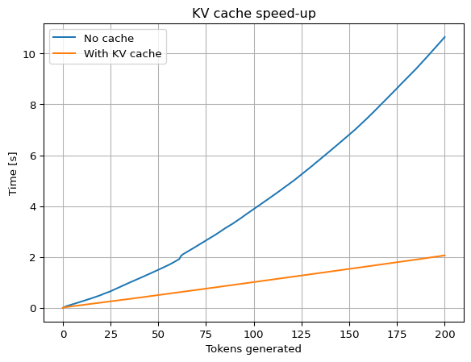

# KV Caching


When pre-training GPTs we calculate $q$, $k$ and $v$ vectors for each
tokens on each forward pass. We need to this as train the prediction of
each token along the input sequence simultaneously. For inference,
however, this approach is not optimal. Due to the autoregressive nature
GPTs each token of the context is typically passed through model
everytime a new token is added to the end of the context. This leads to
two inefficiencies: - The $k$ and $v$ vectors are recalculated on each
forward call - The $q$ vectors are also recalculated for each token,
however, we only need the $q$ vector for the last token in the sequence
In this notebook we will demonstrate how to fix theses inefficiencies.
The former by introducing KC-caching, the latter by some algorithmic
adjustments.

## The problem

Let’s start by demonstrating the problem. We instantiate a very small
GPTModel (the model is not trained and the output will be gibberish but
that does not matter for this demonstration) with a single tranformer
block containing just one attention head. We then register hooks so that
we can monitor the calculated $q$, $k$ and $v$ vectors which are
normally internal to the model.

``` python
# %load_ext autoreload
# %autoreload 2
```

``` python
import tiktoken
import torch

from sturnus.models import GPTModel
from sturnus.util import text_to_tokens, tokens_to_text


GPT_CONFIG_one_attention_head = {
    'vocab_size': 50257,
    'block_size': 1024,
    'count_heads': 1,
    'count_blocks': 1,
    'embed_dim': 768,
    'dropout': 0.1,
    'qkv_bias': True, # Used in GPT2 but typically not in modern LLMs as the biases do not improve performance
}

model_one_att = GPTModel(GPT_CONFIG_one_attention_head)
model_one_att.eval();
```

``` python
captured_values = {}

def attach_hook(layer_name):
    captured_values[layer_name] = []

    def hook(module, input, output):
       captured_values[layer_name].append(output.detach())
    
    return hook

model_one_att.trf_blocks[0].att.W_Q.register_forward_hook(attach_hook('Q'))
model_one_att.trf_blocks[0].att.W_K.register_forward_hook(attach_hook('K'))
model_one_att.trf_blocks[0].att.W_V.register_forward_hook(attach_hook('V'));
```

``` python
tokenizer = tiktoken.get_encoding("gpt2")

tokens = text_to_tokens('Hi', tokenizer)

for i in range(3):
    with torch.no_grad():
        logits = model_one_att.forward(tokens)
    logits = logits[:, -1, :]
    idx_next = torch.argmax(logits, dim=-1, keepdim=True)
    tokens = torch.cat((tokens, idx_next), dim=1)
```

``` python
torch.set_printoptions(edgeitems=2)
torch.set_printoptions(threshold=10)

for name in captured_values:
    for i, v in enumerate(captured_values[name]):
        print(f'{name} iter {i+1}:')
        print(v)
```

    Q iter 1:
    tensor([[[ 0.4637, -0.1619,  ..., -0.7079, -0.4879]]])
    Q iter 2:
    tensor([[[ 0.4637, -0.1619,  ..., -0.7079, -0.4879],
             [ 0.2927,  0.1901,  ...,  0.6331,  0.4722]]])
    Q iter 3:
    tensor([[[ 0.4637, -0.1619,  ..., -0.7079, -0.4879],
             [ 0.2927,  0.1901,  ...,  0.6331,  0.4722],
             [-0.3861,  0.0530,  ..., -0.1762, -0.0097]]])
    K iter 1:
    tensor([[[-0.2633,  0.7545,  ..., -0.4555,  0.2022]]])
    K iter 2:
    tensor([[[-0.2633,  0.7545,  ..., -0.4555,  0.2022],
             [ 0.0728, -0.0837,  ...,  0.7215,  0.0312]]])
    K iter 3:
    tensor([[[-0.2633,  0.7545,  ..., -0.4555,  0.2022],
             [ 0.0728, -0.0837,  ...,  0.7215,  0.0312],
             [-0.6059,  0.3807,  ...,  0.3390, -0.2098]]])
    V iter 1:
    tensor([[[ 0.1537, -0.2270,  ...,  0.0648, -1.2325]]])
    V iter 2:
    tensor([[[ 0.1537, -0.2270,  ...,  0.0648, -1.2325],
             [ 0.8514,  0.6388,  ..., -0.6379, -0.3254]]])
    V iter 3:
    tensor([[[ 0.1537, -0.2270,  ...,  0.0648, -1.2325],
             [ 0.8514,  0.6388,  ..., -0.6379, -0.3254],
             [ 0.0914, -0.0180,  ...,  1.1095,  0.1006]]])

We can here see that the $k$ and $v$ (and indeed $q$) vectors are
recalculated for all the preceding tokens on each new evaluation of the
model as we generate a string of output text.

## The solution

Below we will demonstrate implementation of KV-caching and the speed-up
that it gives. The implementation of the GPT model with KV-caching can
be found
[here](https://github.com/crs17/sturnus/blob/main/src/sturnus/models/gpt2_kv_cache.py).
With caching enabled we just supply the last token instead of the whole
context which means that we do not need to recalculate the $q$ vectors
for previous tokens. This is shown below.

``` python
from sturnus.models import GPTKVCache

GPT_CONFIG_124_openai = {
    'vocab_size': 50257,
    'block_size': 1024,
    'count_heads': 12,
    'count_blocks': 12,
    'embed_dim': 768,
    'dropout': 0.1,
    'qkv_bias': True, # Used in GPT2 but typically not in modern LLMs as the biases do not improve performance
}

model_kv = GPTKVCache(GPT_CONFIG_124_openai)
```

``` python
from sturnus.get_huggingface_parameters import fetch_gpt2_from_huggingface, load_hf_gpt2_weights

openai_state_dict = fetch_gpt2_from_huggingface()
load_hf_gpt2_weights(model_kv, openai_state_dict)
```

    Warning: You are sending unauthenticated requests to the HF Hub. Please set a HF_TOKEN to enable higher rate limits and faster downloads.

    Loading weights:   0%|          | 0/148 [00:00<?, ?it/s]

``` python
import time


def generate_kv(model, start_tokens, count_new_tokens, use_cache=False):
    model.eval()
    torch.manual_seed(42)

    tokens = start_tokens
    model.reset_cache()
    idx_next = None

    token_times = [time.time()]
    for i in range(count_new_tokens):
        with torch.no_grad():
            if use_cache:
                new_tokens = start_tokens if idx_next is None else idx_next
                logits = model.forward(new_tokens, use_cache=use_cache)
            else:
                logits = model.forward(tokens, use_cache=use_cache)
        logits = logits[:, -1, :]
        idx_next = torch.argmax(logits, dim=-1, keepdim=True)
        tokens = torch.cat((tokens, idx_next), dim=1)
        token_times.append(time.time())

    token_times = [t - token_times[0] for t in token_times]
    return tokens, token_times


N = 200
start_tokens = text_to_tokens("Don't worry about things you cannot control", tokenizer)

new_tokens_no_cache, times_no_cache = generate_kv(model_kv, start_tokens, count_new_tokens=N, use_cache=False)
new_tokens_cache, times_cache = generate_kv(model_kv, start_tokens, count_new_tokens=N, use_cache=True)
```

We see that the model produce the same output with and without caching
which is a nice sanity check:

``` python
tokens_to_text(new_tokens_no_cache, tokenizer)
```

    "Don't worry about things you cannot control. You can control your own destiny.\n\nI'm not saying that you can't control your own destiny. I'm saying that you can control your own destiny.\n\nI'm not saying that you can't control your own destiny. I'm saying that you can control your own destiny.\n\nI'm not saying that you can't control your own destiny. I'm saying that you can control your own destiny.\n\nI'm not saying that you can't control your own destiny. I'm saying that you can control your own destiny.\n\nI'm not saying that you can't control your own destiny. I'm saying that you can control your own destiny.\n\nI'm not saying that you can't control your own destiny. I'm saying that you can control your own destiny.\n\nI'm not saying that you can't control your own destiny. I'm saying that you can control your own destiny.\n\nI'm not saying that you can't"

``` python
tokens_to_text(new_tokens_cache, tokenizer)
```

    "Don't worry about things you cannot control. You can control your own destiny.\n\nI'm not saying that you can't control your own destiny. I'm saying that you can control your own destiny.\n\nI'm not saying that you can't control your own destiny. I'm saying that you can control your own destiny.\n\nI'm not saying that you can't control your own destiny. I'm saying that you can control your own destiny.\n\nI'm not saying that you can't control your own destiny. I'm saying that you can control your own destiny.\n\nI'm not saying that you can't control your own destiny. I'm saying that you can control your own destiny.\n\nI'm not saying that you can't control your own destiny. I'm saying that you can control your own destiny.\n\nI'm not saying that you can't control your own destiny. I'm saying that you can control your own destiny.\n\nI'm not saying that you can't"

Plotting the computation time as function of the number of tokens
generated, we see that the time grows linearly for the cached version of
the model. The non-cached version sees computation time growning much
faster leading to a very significant speed-up when using KV-caching.

``` python
import matplotlib.pylab as plt

fig, ax = plt.subplots()

ax.plot(times_no_cache, label='No cache')
ax.plot(times_cache, label='With KV cache')

ax.set_title('KV cache speed-up')
ax.set_xlabel('Tokens generated')
ax.set_ylabel('Time [s]')

ax.grid()

ax.legend();
```


