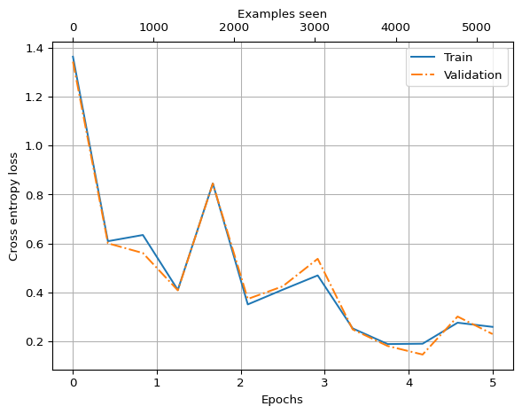

# LoRA Fine-Tuning


In this notebook we will implement [Low-Rank Adaptation,
LoRA](https://arxiv.org/abs/2106.09685), as an approach for fine-tuning.

This notebook is inspired by Appendix E in of [Build A Larger Language
Model (from scratch)](https://sebastianraschka.com/llms-from-scratch/)
by Sebastian Raschka and I highly recommend the book.

In fine-tuning the goal is to modify the parameters, $W_0$, of a LLM so
that the updated parameters $W = W_0 + \Delta W$ improves the
performance of the LLM on a given task. A popular approach for
fine-tuning large language models is LoRA where instead of optimizing
all parameters, a low-rank adaption is used:

$$
 W = W_0 + \Delta W = W_0 + BA
$$

where \$A ^{r k} \$, $B \in \R^{d \times r}$ and
$W_0 \in \R ^{d \times k}$ with $r \ll \min(d, k)$. So instead of
optimizing $\Delta W$, we optimize $A$ and $B$ which contain
significantly fewer parameters.

Below we implement the LoRA adaptation with $r$ represented by `rank`. A
scaling hyperparameter `alpha` is introduced which tunes the size of the
effect of the LoRA adaption on the original model.

``` python
import torch

class LoRALayer(torch.nn.Module):
    def __init__(self, d_in, d_out, rank, alpha):
        super().__init__()
        self.A = torch.nn.Parameter(torch.empty(d_in, rank))
        torch.nn.init.kaiming_uniform_(self.A, a=torch.sqrt(torch.tensor(5)).item())
        self.B = torch.nn.Parameter(torch.zeros(rank, d_out))
        self.alpha = alpha
        self.rank = rank

    def forward(self, x):
        x = (self.alpha / self.rank) * (x @ self.A @ self.B)
        return x
```

While the original paper mentions a Gaussian initialization for $A$,
current practize seems to be using a uniform
[Kaiming](https://arxiv.org/abs/1502.01852) initialization for $A$ so we
will stick with that. On the other hand, $B$ is initialized to zero. In
that way, the fine-tuning will start with a model that is effectively
the same as the original model.

Let’s make a torch module for a linear layer with LoRA adaptation:

``` python
class LinearWithLoRA(torch.nn.Module):
    def __init__(self, linear, rank, alpha):
        super().__init__()
        self.lora = LoRALayer(linear.in_features, linear.out_features, rank, alpha)
        self.linear = linear

        return

    def forward(self, x):
        return self.linear(x) + self.lora(x)
```

As usual we will instantiate our implementation of GPT2 and load the
OpenAI weights from Hugging Face:

``` python
from sturnus.models import GPTModel

GPT_CONFIG_124_openai = {
    'vocab_size': 50257,
    'block_size': 1024,
    'count_heads': 12,
    'count_blocks': 12,
    'embed_dim': 768,
    'dropout': 0.1,
    'qkv_bias': True, # Used in GPT2 but typically not in modern LLMs as the biases do not improve performance
}

model = GPTModel(GPT_CONFIG_124_openai)
```

``` python
from sturnus.get_huggingface_parameters import fetch_gpt2_from_huggingface, load_hf_gpt2_weights

openai_state_dict = fetch_gpt2_from_huggingface()
load_hf_gpt2_weights(model, openai_state_dict)
```

    Loading weights:   0%|          | 0/148 [00:00<?, ?it/s]

Next, we set up the model classification (by reducing the number of
output neurons to two) and freeze original parameters:

``` python
print('Before:', model.out_head)
model.out_head = torch.nn.Linear(768, 2)
print('After:', model.out_head)
```

    Before: Linear(in_features=768, out_features=50257, bias=False)
    After: Linear(in_features=768, out_features=2, bias=True)

``` python
for param in model.parameters():
    param.requires_grad = False
```

``` python
def replace_linears_with_lora(model, rank, alpha):
    for name, module in model.named_children():
        if isinstance(module, torch.nn.Linear):
            # print(f'Replacing {name}')
            setattr(model, name, LinearWithLoRA(module, rank, alpha))
        else:
            replace_linears_with_lora(module, rank, alpha)

replace_linears_with_lora(model, rank=16, alpha=16)
```

``` python
total_params = sum(p.numel() for p in model.parameters() if p.requires_grad)
print(f"Total trainable LoRA parameters: {total_params:,}")
```

    Total trainable LoRA parameters: 2,666,528

``` python
device = 'mps'
model.to(device)
```

    GPTModel(
      (tok_emb): Embedding(50257, 768)
      (pos_emb): Embedding(1024, 768)
      (drop_emb): Dropout(p=0.1, inplace=False)
      (trf_blocks): Sequential(
        (0): TransformerBlock(
          (att): MultiHeadAttention(
            (W_Q): LinearWithLoRA(
              (lora): LoRALayer()
              (linear): Linear(in_features=768, out_features=768, bias=True)
            )
            (W_K): LinearWithLoRA(
              (lora): LoRALayer()
              (linear): Linear(in_features=768, out_features=768, bias=True)
            )
            (W_V): LinearWithLoRA(
              (lora): LoRALayer()
              (linear): Linear(in_features=768, out_features=768, bias=True)
            )
            (out_projection): LinearWithLoRA(
              (lora): LoRALayer()
              (linear): Linear(in_features=768, out_features=768, bias=True)
            )
            (dropout): Dropout(p=0.1, inplace=False)
          )
          (ln1): LayerNorm()
          (ffn): FeedForward(
            (layers): Sequential(
              (0): LinearWithLoRA(
                (lora): LoRALayer()
                (linear): Linear(in_features=768, out_features=3072, bias=True)
              )
              (1): GELU(approximate='tanh')
              (2): LinearWithLoRA(
                (lora): LoRALayer()
                (linear): Linear(in_features=3072, out_features=768, bias=True)
              )
            )
          )
          (ln2): LayerNorm()
          (dropout): Dropout(p=0.1, inplace=False)
        )
        (1): TransformerBlock(
          (att): MultiHeadAttention(
            (W_Q): LinearWithLoRA(
              (lora): LoRALayer()
              (linear): Linear(in_features=768, out_features=768, bias=True)
            )
            (W_K): LinearWithLoRA(
              (lora): LoRALayer()
              (linear): Linear(in_features=768, out_features=768, bias=True)
            )
            (W_V): LinearWithLoRA(
              (lora): LoRALayer()
              (linear): Linear(in_features=768, out_features=768, bias=True)
            )
            (out_projection): LinearWithLoRA(
              (lora): LoRALayer()
              (linear): Linear(in_features=768, out_features=768, bias=True)
            )
            (dropout): Dropout(p=0.1, inplace=False)
          )
          (ln1): LayerNorm()
          (ffn): FeedForward(
            (layers): Sequential(
              (0): LinearWithLoRA(
                (lora): LoRALayer()
                (linear): Linear(in_features=768, out_features=3072, bias=True)
              )
              (1): GELU(approximate='tanh')
              (2): LinearWithLoRA(
                (lora): LoRALayer()
                (linear): Linear(in_features=3072, out_features=768, bias=True)
              )
            )
          )
          (ln2): LayerNorm()
          (dropout): Dropout(p=0.1, inplace=False)
        )
        (2): TransformerBlock(
          (att): MultiHeadAttention(
            (W_Q): LinearWithLoRA(
              (lora): LoRALayer()
              (linear): Linear(in_features=768, out_features=768, bias=True)
            )
            (W_K): LinearWithLoRA(
              (lora): LoRALayer()
              (linear): Linear(in_features=768, out_features=768, bias=True)
            )
            (W_V): LinearWithLoRA(
              (lora): LoRALayer()
              (linear): Linear(in_features=768, out_features=768, bias=True)
            )
            (out_projection): LinearWithLoRA(
              (lora): LoRALayer()
              (linear): Linear(in_features=768, out_features=768, bias=True)
            )
            (dropout): Dropout(p=0.1, inplace=False)
          )
          (ln1): LayerNorm()
          (ffn): FeedForward(
            (layers): Sequential(
              (0): LinearWithLoRA(
                (lora): LoRALayer()
                (linear): Linear(in_features=768, out_features=3072, bias=True)
              )
              (1): GELU(approximate='tanh')
              (2): LinearWithLoRA(
                (lora): LoRALayer()
                (linear): Linear(in_features=3072, out_features=768, bias=True)
              )
            )
          )
          (ln2): LayerNorm()
          (dropout): Dropout(p=0.1, inplace=False)
        )
        (3): TransformerBlock(
          (att): MultiHeadAttention(
            (W_Q): LinearWithLoRA(
              (lora): LoRALayer()
              (linear): Linear(in_features=768, out_features=768, bias=True)
            )
            (W_K): LinearWithLoRA(
              (lora): LoRALayer()
              (linear): Linear(in_features=768, out_features=768, bias=True)
            )
            (W_V): LinearWithLoRA(
              (lora): LoRALayer()
              (linear): Linear(in_features=768, out_features=768, bias=True)
            )
            (out_projection): LinearWithLoRA(
              (lora): LoRALayer()
              (linear): Linear(in_features=768, out_features=768, bias=True)
            )
            (dropout): Dropout(p=0.1, inplace=False)
          )
          (ln1): LayerNorm()
          (ffn): FeedForward(
            (layers): Sequential(
              (0): LinearWithLoRA(
                (lora): LoRALayer()
                (linear): Linear(in_features=768, out_features=3072, bias=True)
              )
              (1): GELU(approximate='tanh')
              (2): LinearWithLoRA(
                (lora): LoRALayer()
                (linear): Linear(in_features=3072, out_features=768, bias=True)
              )
            )
          )
          (ln2): LayerNorm()
          (dropout): Dropout(p=0.1, inplace=False)
        )
        (4): TransformerBlock(
          (att): MultiHeadAttention(
            (W_Q): LinearWithLoRA(
              (lora): LoRALayer()
              (linear): Linear(in_features=768, out_features=768, bias=True)
            )
            (W_K): LinearWithLoRA(
              (lora): LoRALayer()
              (linear): Linear(in_features=768, out_features=768, bias=True)
            )
            (W_V): LinearWithLoRA(
              (lora): LoRALayer()
              (linear): Linear(in_features=768, out_features=768, bias=True)
            )
            (out_projection): LinearWithLoRA(
              (lora): LoRALayer()
              (linear): Linear(in_features=768, out_features=768, bias=True)
            )
            (dropout): Dropout(p=0.1, inplace=False)
          )
          (ln1): LayerNorm()
          (ffn): FeedForward(
            (layers): Sequential(
              (0): LinearWithLoRA(
                (lora): LoRALayer()
                (linear): Linear(in_features=768, out_features=3072, bias=True)
              )
              (1): GELU(approximate='tanh')
              (2): LinearWithLoRA(
                (lora): LoRALayer()
                (linear): Linear(in_features=3072, out_features=768, bias=True)
              )
            )
          )
          (ln2): LayerNorm()
          (dropout): Dropout(p=0.1, inplace=False)
        )
        (5): TransformerBlock(
          (att): MultiHeadAttention(
            (W_Q): LinearWithLoRA(
              (lora): LoRALayer()
              (linear): Linear(in_features=768, out_features=768, bias=True)
            )
            (W_K): LinearWithLoRA(
              (lora): LoRALayer()
              (linear): Linear(in_features=768, out_features=768, bias=True)
            )
            (W_V): LinearWithLoRA(
              (lora): LoRALayer()
              (linear): Linear(in_features=768, out_features=768, bias=True)
            )
            (out_projection): LinearWithLoRA(
              (lora): LoRALayer()
              (linear): Linear(in_features=768, out_features=768, bias=True)
            )
            (dropout): Dropout(p=0.1, inplace=False)
          )
          (ln1): LayerNorm()
          (ffn): FeedForward(
            (layers): Sequential(
              (0): LinearWithLoRA(
                (lora): LoRALayer()
                (linear): Linear(in_features=768, out_features=3072, bias=True)
              )
              (1): GELU(approximate='tanh')
              (2): LinearWithLoRA(
                (lora): LoRALayer()
                (linear): Linear(in_features=3072, out_features=768, bias=True)
              )
            )
          )
          (ln2): LayerNorm()
          (dropout): Dropout(p=0.1, inplace=False)
        )
        (6): TransformerBlock(
          (att): MultiHeadAttention(
            (W_Q): LinearWithLoRA(
              (lora): LoRALayer()
              (linear): Linear(in_features=768, out_features=768, bias=True)
            )
            (W_K): LinearWithLoRA(
              (lora): LoRALayer()
              (linear): Linear(in_features=768, out_features=768, bias=True)
            )
            (W_V): LinearWithLoRA(
              (lora): LoRALayer()
              (linear): Linear(in_features=768, out_features=768, bias=True)
            )
            (out_projection): LinearWithLoRA(
              (lora): LoRALayer()
              (linear): Linear(in_features=768, out_features=768, bias=True)
            )
            (dropout): Dropout(p=0.1, inplace=False)
          )
          (ln1): LayerNorm()
          (ffn): FeedForward(
            (layers): Sequential(
              (0): LinearWithLoRA(
                (lora): LoRALayer()
                (linear): Linear(in_features=768, out_features=3072, bias=True)
              )
              (1): GELU(approximate='tanh')
              (2): LinearWithLoRA(
                (lora): LoRALayer()
                (linear): Linear(in_features=3072, out_features=768, bias=True)
              )
            )
          )
          (ln2): LayerNorm()
          (dropout): Dropout(p=0.1, inplace=False)
        )
        (7): TransformerBlock(
          (att): MultiHeadAttention(
            (W_Q): LinearWithLoRA(
              (lora): LoRALayer()
              (linear): Linear(in_features=768, out_features=768, bias=True)
            )
            (W_K): LinearWithLoRA(
              (lora): LoRALayer()
              (linear): Linear(in_features=768, out_features=768, bias=True)
            )
            (W_V): LinearWithLoRA(
              (lora): LoRALayer()
              (linear): Linear(in_features=768, out_features=768, bias=True)
            )
            (out_projection): LinearWithLoRA(
              (lora): LoRALayer()
              (linear): Linear(in_features=768, out_features=768, bias=True)
            )
            (dropout): Dropout(p=0.1, inplace=False)
          )
          (ln1): LayerNorm()
          (ffn): FeedForward(
            (layers): Sequential(
              (0): LinearWithLoRA(
                (lora): LoRALayer()
                (linear): Linear(in_features=768, out_features=3072, bias=True)
              )
              (1): GELU(approximate='tanh')
              (2): LinearWithLoRA(
                (lora): LoRALayer()
                (linear): Linear(in_features=3072, out_features=768, bias=True)
              )
            )
          )
          (ln2): LayerNorm()
          (dropout): Dropout(p=0.1, inplace=False)
        )
        (8): TransformerBlock(
          (att): MultiHeadAttention(
            (W_Q): LinearWithLoRA(
              (lora): LoRALayer()
              (linear): Linear(in_features=768, out_features=768, bias=True)
            )
            (W_K): LinearWithLoRA(
              (lora): LoRALayer()
              (linear): Linear(in_features=768, out_features=768, bias=True)
            )
            (W_V): LinearWithLoRA(
              (lora): LoRALayer()
              (linear): Linear(in_features=768, out_features=768, bias=True)
            )
            (out_projection): LinearWithLoRA(
              (lora): LoRALayer()
              (linear): Linear(in_features=768, out_features=768, bias=True)
            )
            (dropout): Dropout(p=0.1, inplace=False)
          )
          (ln1): LayerNorm()
          (ffn): FeedForward(
            (layers): Sequential(
              (0): LinearWithLoRA(
                (lora): LoRALayer()
                (linear): Linear(in_features=768, out_features=3072, bias=True)
              )
              (1): GELU(approximate='tanh')
              (2): LinearWithLoRA(
                (lora): LoRALayer()
                (linear): Linear(in_features=3072, out_features=768, bias=True)
              )
            )
          )
          (ln2): LayerNorm()
          (dropout): Dropout(p=0.1, inplace=False)
        )
        (9): TransformerBlock(
          (att): MultiHeadAttention(
            (W_Q): LinearWithLoRA(
              (lora): LoRALayer()
              (linear): Linear(in_features=768, out_features=768, bias=True)
            )
            (W_K): LinearWithLoRA(
              (lora): LoRALayer()
              (linear): Linear(in_features=768, out_features=768, bias=True)
            )
            (W_V): LinearWithLoRA(
              (lora): LoRALayer()
              (linear): Linear(in_features=768, out_features=768, bias=True)
            )
            (out_projection): LinearWithLoRA(
              (lora): LoRALayer()
              (linear): Linear(in_features=768, out_features=768, bias=True)
            )
            (dropout): Dropout(p=0.1, inplace=False)
          )
          (ln1): LayerNorm()
          (ffn): FeedForward(
            (layers): Sequential(
              (0): LinearWithLoRA(
                (lora): LoRALayer()
                (linear): Linear(in_features=768, out_features=3072, bias=True)
              )
              (1): GELU(approximate='tanh')
              (2): LinearWithLoRA(
                (lora): LoRALayer()
                (linear): Linear(in_features=3072, out_features=768, bias=True)
              )
            )
          )
          (ln2): LayerNorm()
          (dropout): Dropout(p=0.1, inplace=False)
        )
        (10): TransformerBlock(
          (att): MultiHeadAttention(
            (W_Q): LinearWithLoRA(
              (lora): LoRALayer()
              (linear): Linear(in_features=768, out_features=768, bias=True)
            )
            (W_K): LinearWithLoRA(
              (lora): LoRALayer()
              (linear): Linear(in_features=768, out_features=768, bias=True)
            )
            (W_V): LinearWithLoRA(
              (lora): LoRALayer()
              (linear): Linear(in_features=768, out_features=768, bias=True)
            )
            (out_projection): LinearWithLoRA(
              (lora): LoRALayer()
              (linear): Linear(in_features=768, out_features=768, bias=True)
            )
            (dropout): Dropout(p=0.1, inplace=False)
          )
          (ln1): LayerNorm()
          (ffn): FeedForward(
            (layers): Sequential(
              (0): LinearWithLoRA(
                (lora): LoRALayer()
                (linear): Linear(in_features=768, out_features=3072, bias=True)
              )
              (1): GELU(approximate='tanh')
              (2): LinearWithLoRA(
                (lora): LoRALayer()
                (linear): Linear(in_features=3072, out_features=768, bias=True)
              )
            )
          )
          (ln2): LayerNorm()
          (dropout): Dropout(p=0.1, inplace=False)
        )
        (11): TransformerBlock(
          (att): MultiHeadAttention(
            (W_Q): LinearWithLoRA(
              (lora): LoRALayer()
              (linear): Linear(in_features=768, out_features=768, bias=True)
            )
            (W_K): LinearWithLoRA(
              (lora): LoRALayer()
              (linear): Linear(in_features=768, out_features=768, bias=True)
            )
            (W_V): LinearWithLoRA(
              (lora): LoRALayer()
              (linear): Linear(in_features=768, out_features=768, bias=True)
            )
            (out_projection): LinearWithLoRA(
              (lora): LoRALayer()
              (linear): Linear(in_features=768, out_features=768, bias=True)
            )
            (dropout): Dropout(p=0.1, inplace=False)
          )
          (ln1): LayerNorm()
          (ffn): FeedForward(
            (layers): Sequential(
              (0): LinearWithLoRA(
                (lora): LoRALayer()
                (linear): Linear(in_features=768, out_features=3072, bias=True)
              )
              (1): GELU(approximate='tanh')
              (2): LinearWithLoRA(
                (lora): LoRALayer()
                (linear): Linear(in_features=3072, out_features=768, bias=True)
              )
            )
          )
          (ln2): LayerNorm()
          (dropout): Dropout(p=0.1, inplace=False)
        )
      )
      (final_norm): LayerNorm()
      (out_head): LinearWithLoRA(
        (lora): LoRALayer()
        (linear): Linear(in_features=768, out_features=2, bias=True)
      )
    )

``` python
from sturnus.utils.classification import ClassificationDataset

train_loader = torch.load('spam/train_loader.pt', weights_only=False)
val_loader = torch.load('spam/val_loader.pt', weights_only=False)
test_loader = torch.load('spam/test_loader.pt', weights_only=False)
```

``` python
for i in train_loader:
    print(i)
    break
```

    [tensor([[16454,   475,  1312,  ..., 50256, 50256, 50256],
            [11146, 31456,    13,  ..., 50256, 50256, 50256],
            [20827, 18508,   532,  ..., 50256, 50256, 50256],
            ...,
            [21478,   869,   334,  ..., 50256, 50256, 50256],
            [   36, 11262, 10619,  ..., 50256, 50256, 50256],
            [ 5122,  4508,   649,  ..., 50256, 50256, 50256]]), tensor([0, 1, 1, 1, 0, 0, 1, 1])]

``` python
from sturnus.utils.classification import calc_loss_loader, calc_accuracy_loader


with torch.no_grad():
    train_loss = calc_loss_loader(model, train_loader, device, 1)
    val_loss = calc_loss_loader(model, val_loader, device, 1)
    test_loss = calc_loss_loader(model, test_loader, device, 1)

print(f'Train:      {train_loss}')
print(f'Validation: {val_loss}')
print(f'Test:       {test_loss}')
```

    Train:      2.1783297061920166
    Validation: 1.2023704051971436
    Test:       1.8633110523223877

``` python
device
```

    'mps'

``` python
from sturnus.utils.classification import calc_accuracy_loader

train_accuracy = calc_accuracy_loader(model, train_loader, device)
val_accuracy = calc_accuracy_loader(model, val_loader, device)
test_accuracy = calc_accuracy_loader(model, test_loader, device)

print(f"Training accuracy: {train_accuracy*100:.2f}%")
print(f"Validation accuracy: {val_accuracy*100:.2f}%")
print(f"Test accuracy: {test_accuracy*100:.2f}%")
```

    Training accuracy: 51.83%
    Validation accuracy: 45.98%
    Test accuracy: 46.88%

``` python
from sturnus.utils.classification import fine_tune_classification

num_epochs = 5
optimizer = torch.optim.AdamW(model.parameters(), lr=5e-5, weight_decay=0.1)
train_losses, val_losses, eval_steps, train_accuracies, validation_accuracies, examples_seen = fine_tune_classification(
    model, optimizer, device, train_loader, val_loader, num_epochs,
    eval_batch_count=50, eval_freq=50,
)
```

    Epoch 1 has started
    Step:     0 Train loss:   1.3630 Validation loss:   1.3426
    Step:    50 Train loss:   0.6095 Validation loss:   0.6011
    Step:   100 Train loss:   0.6349 Validation loss:   0.5612
    Epoch 1 done. Train accuracy: 84.00 %. Validation accuracy: 84.38 %.
    Epoch 2 has started
    Step:   150 Train loss:   0.4106 Validation loss:   0.4089
    Step:   200 Train loss:   0.8456 Validation loss:   0.8452
    Step:   250 Train loss:   0.3515 Validation loss:   0.3738
    Epoch 2 done. Train accuracy: 81.50 %. Validation accuracy: 78.57 %.
    Epoch 3 has started
    Step:   300 Train loss:   0.4115 Validation loss:   0.4254
    Step:   350 Train loss:   0.4699 Validation loss:   0.5378
    Epoch 3 done. Train accuracy: 85.75 %. Validation accuracy: 85.71 %.
    Epoch 4 has started
    Step:   400 Train loss:   0.2536 Validation loss:   0.2495
    Step:   450 Train loss:   0.1896 Validation loss:   0.1817
    Step:   500 Train loss:   0.1910 Validation loss:   0.1468
    Epoch 4 done. Train accuracy: 96.50 %. Validation accuracy: 95.54 %.
    Epoch 5 has started
    Step:   550 Train loss:   0.2768 Validation loss:   0.3020
    Step:   600 Train loss:   0.2598 Validation loss:   0.2305
    Epoch 5 done. Train accuracy: 95.00 %. Validation accuracy: 94.20 %.

``` python
import matplotlib.pylab as plt


epochs_tensor = torch.linspace(0, num_epochs, len(train_losses))
examples_seen_tensor = torch.linspace(0, examples_seen, len(train_losses))

fig, ax = plt.subplots()

ax.plot(
    epochs_tensor,
    train_losses,
    label='Train'
)

ax.plot(
    epochs_tensor,
    val_losses,
    '-.',
    label='Validation'
)

ax2 = ax.twiny()
ax2.plot(
    examples_seen_tensor,
    train_losses,
    alpha=0
)

ax.grid()
ax.set_ylabel('Cross entropy loss')
ax.set_xlabel('Epochs')
ax2.set_xlabel('Examples seen')
ax.legend()
```



``` python
train_accuracy = calc_accuracy_loader(model, train_loader, device)
val_accuracy = calc_accuracy_loader(model, val_loader, device)
test_accuracy = calc_accuracy_loader(model, test_loader, device)

print(f"Training accuracy: {train_accuracy*100:.2f}%")
print(f"Validation accuracy: {val_accuracy*100:.2f}%")
print(f"Test accuracy: {test_accuracy*100:.2f}%")
```

    Training accuracy: 94.42%
    Validation accuracy: 94.20%
    Test accuracy: 91.52%

So we get accuracies in the order of 90 % after LoRA fine-tuning. This
is lower than what we achieved when fine-tuning all parameters in the
last transformer block. Yet, this still demonstrates that the LoRA
approach works.
