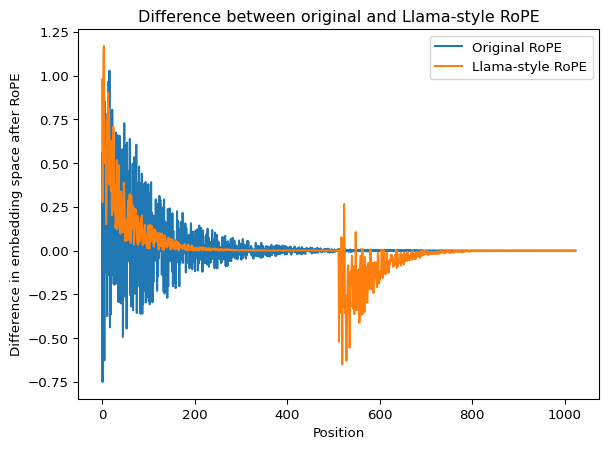

# Mixture of Experts


In this notebook we set out to add [sparsely-gated mixture of expert
layers](https://arxiv.org/abs/1701.06538) (MoE) to our implementation of
the GPT2 model.

In the standard GPT2 model each transformer block has a single
feed-forward neural network. The idea in MoE is to instead have multiple
feed-forward neural networks in each transformer block with the added
condition that only a subset of these networks are active for each
forward pass. This allows the neural networks to specialize and gives
the model more parameters without significantly increased compute costs.

A gating network $G(x)$ controls which experts are used given the input
data and the output of the MoE module then becomes:

$$y = \sum_{i}^{n} G(x)_i E_i(x)$$

where $G(x)_i$ is the i’th output of the gating network, $E_i(x)$ is the
output of the i’th expert and $n$ is the number of experts.

The gating network can be a single linear layer without bias with a
softmax activation:

$$G(x) = \text{softmax}(\text{topK}(x \cdot W_g))$$

In the Shazeer paper linked above, a noise term was also added in the
gating function to introduce some randomness in the selection process.
This is done to enable better load-balancing between the experts.
However, later implementations such as the [Switch
Transformers](https://arxiv.org/abs/2101.03961) and
[GLaM](https://arxiv.org/abs/2112.06905) have abandoned the noise term
again. Instead, an auxiliary loss term is added to ensure
load-balancing.

Expert capacity can be defined as:

$$ E = \frac{k \cdot B \cdot C}{ N} \alpha $$

where $k$ is the number of active experts, $B$ is the batch size, $C$ is
the context length, $N$ is the total number of experts and $\alpha$ is
the capacity factor. A capacity factor of 1 enforces equal distribution
of the tokens but if the router decides to send a larger proportion of
the tokens in a batch to a specific expert, those additional tokens are
dropped by the expert (however they are still passed on via the shortcut
connection of the transformer block). Setting a larger capacity factor
reduces the amount of dropped tokens at an efficiency loss due to less
uniform distribution among the experts.

An un-optimised version of MoE was implemented
[here](https://github.com/crs17/sturnus/blob/main/src/sturnus/models/granite.py).
Expert capacity was not implemented this time around as the model we
will test against (see below) employs a dropless MoE approach.

The smallest open-weight MoE model I could find is IBM’s
`Granite-3.0-1B-A400M`. So the goal is to re-implement this model so
that we can download the open weights for testing the MoE
implementation. However, the `Granite-3.0-1B-A400M` model has a few
additional changes relative to our GPT2 implementation besides the
Mixture of Experts - so we need to implement these as well.

## Changes needed to implement Granite when starting from GPT2

### Rotary position embeddings instead of learned absolute position embeddings

Rotary position embeddings employs a clever scheme of rotations that
allows for the relative positions of tokens taken into account in the
attention blocks. This
[demo](https://github.com/crs17/sturnus/blob/main/demos/RoPE.md)
visualizes the rotations and resulting attention scores calculated using
my
[implementation](https://github.com/crs17/sturnus/blob/main/src/sturnus/models/rope.py).
The Granite model does, however, not implement the original RoPE
embeddings where rotation is applied to 2D vectors along the embedding
dimension. Instead the Granite model uses llama-style RoPE where the 2D
vectors are constructed by pairing $x_i$ with $x_{i+P/2}$.

``` python
import torch

from sturnus.models.rope import calculate_thetas, apply_rope, apply_rope_half

B = 2
C = 100
H = 5
P = 1024

c_values, thetas = calculate_thetas(embedding_dimension=P, context_size=C)

x = torch.rand(B, C, H, P)  # [B, C, H, P]

x_ = apply_rope(x, c_values)
x_half = apply_rope_half(x, c_values)
```

``` python
import matplotlib.pyplot as plt

fig, ax = plt.subplots()

d_values = x[0, 1, 0, :]- x_[0, 1, 0, :]
d_half_values = x[0, 1, 0, :]- x_half[0, 1, 0, :]

ax.plot(range(P), d_values, label='Original RoPE')
ax.plot(range(P), d_half_values, label='Llama-style RoPE')

ax.set_xlabel('Position')
ax.set_ylabel('Difference in embedding space after RoPE')
ax.set_title('Difference between original and Llama-style RoPE')
ax.legend();
```



Above we see the resulting differences in embedding values after
application of the two RoPE styles. Whereas the original RoPE mainly
rotates the first embedding dimensions, llama-style RoPE rotates the
first dimensions as well as the first part of the second half of the
dimension.

### Grouped-query Attention instead of Multi-head Attention

Grouped-query attention
([demo](https://github.com/crs17/sturnus/blob/main/demos/Grouped-query_attention.md)
and
[implementation](https://github.com/crs17/sturnus/blob/main/src/sturnus/models/gqa.py))
optimises required compute and memory by sharing key and value head
between grouped query heads. I implemented a Group-query attention block
with RoPE as part of the
[Granite](https://github.com/crs17/sturnus/blob/main/src/sturnus/models/granite.py)
implementation.

### RMSNorm instead of LayerNorm

RMSNorm is implemented as part of the
[Granite](https://github.com/crs17/sturnus/blob/main/src/sturnus/models/granite.py)
model.

### SwiGLU instead of GELU activation

The
[Granite](https://github.com/crs17/sturnus/blob/main/src/sturnus/models/granite.py)
model implements [SwiGLU](https://arxiv.org/pdf/2002.05202) which is a
combination of the swish activation function,
$\text{Swish}(x) = x \cdot \text{sigmoid}(\beta x)$, and a gated linear
unit so that:

$$\text{SwiGLU}(x) =  W_2(\text{Swish}(xW) \odot xV)$$

### Some scalar multipliers

Four different scalar multipliers was added at different places in the
model to ensure consistency with the official Granite model. These
include: - An attention multiplier of $1/64$. As the per-head embedding
dimension is 64 this corresponds to [muP
scaling](https://arxiv.org/abs/2203.03466) rather than the usual
$\sqrt(P)$ scaling - An embedding multiplier of 12.0 - A logits scaling
factor of 6.0 - A residual multiplier of 0.22

## Instantiate Granite Model

After implementing the above changes, we are ready to instantiate the
Granite model:

``` python
from sturnus.models.granite import GraniteModel

# Config from
# https://huggingface.co/ibm-granite/granite-3.0-1b-a400m-base/blob/main/config.json

GRANITE_CONFIG = {
    'embed_dim': 1024,
    'count_blocks': 24,

    'block_size': 4096,
    'count_query_heads': 16,
    'count_kv_heads': 8,

    'count_experts': 32,
    'count_experts_used': 8,
    'mlp_hidden_size': 512,

    'vocab_size': 49152,
    'dropout': 0.0,
    'qkv_bias': False,

    'rope_theta': 10000,

    'attention_multiplier': 0.015625,
    'embedding_multiplier': 12.0,
    'logits_scaling': 6.0,
    'residual_multiplier': 0.22,
    'rms_norm_eps': 1e-06,
}

granite = GraniteModel(GRANITE_CONFIG)
```

Next, we will fetch the Granite weights from HuggingFace and load them
into our model:

``` python
from sturnus.get_huggingface_parameters import fetch_granite_from_huggingface, load_hf_granite_weights

granite_state_dict = fetch_granite_from_huggingface()
load_hf_granite_weights(granite, granite_state_dict)
```

    Warning: You are sending unauthenticated requests to the HF Hub. Please set a HF_TOKEN to enable higher rate limits and faster downloads.

    Loading weights:   0%|          | 0/219 [00:00<?, ?it/s]

``` python
from transformers import AutoTokenizer
from sturnus.util import text_to_tokens, generate_and_print_sample


tokenizer = AutoTokenizer.from_pretrained("ibm-granite/granite-3.0-1b-a400m-base")

device='cpu'
start_context = 'The block of granite which was an obstacle in the pathway of the weak, became a stepping-stone in the pathway of the strong. -Thomas Carlyle'

granite.eval()

generate_and_print_sample(granite, tokenizer, device, start_context, context_size=GRANITE_CONFIG['block_size'], decoder_kwargs={'clean_up_tokenization_spaces': False})
```

    The block of granite which was an obstacle in the pathway of the weak, became a stepping-stone in the pathway of the strong. -Thomas Carlyle  The stronger the block, the more difficult it is to move. -Unknown  The stronger the block, the more difficult it is to move. -Unknown  The stronger the block, the more difficult it is to

We see that the model produces at least grammatically meaningful
English, which is a good indication that implementation is correct.

To be certain, we will compare the output logits of our implementation
with those of the official Granite to check if they match:

``` python
from transformers import AutoModelForCausalLM

hf_model = AutoModelForCausalLM.from_pretrained("ibm-granite/granite-3.0-1b-a400m-base")

hf_model.eval()
granite.eval()

input_ids = text_to_tokens(start_context, tokenizer)
batched_input_ids = input_ids.repeat(2, 1)

with torch.no_grad():
    hf_logits = hf_model(batched_input_ids).logits
    granite_logits = granite(batched_input_ids)

print((hf_logits - granite_logits).abs().max())
print(torch.allclose(hf_logits, granite_logits, atol=1e-3))
```

    Loading weights:   0%|          | 0/219 [00:00<?, ?it/s]

    tensor(4.1008e-05)
    True

The logits are identical within an acceptable tolerance. So that means
that our implementations of MoE, RoPE and GQA are correct :-)
