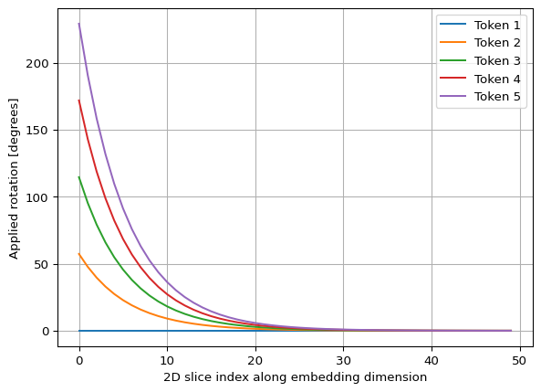
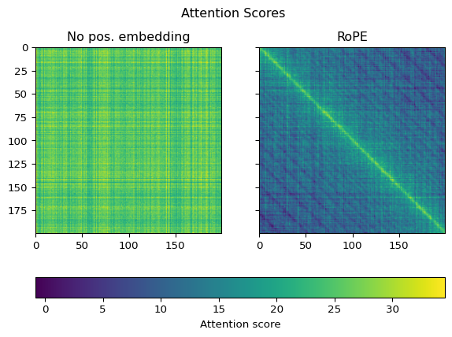

# Rotary Position Embedding
Chresten R. Søndergaard

## RoPE position embeddings

In contrast to the GPT2 implementation where the position embeddings are
learned, [Rotary Position Embedding
(RoPE)](https://arxiv.org/abs/2104.09864) uses fixed equations for the
positional embeddings. Also, GPT2 mixes positional and semantic
embeddings by adding them together, RoPE instead separates out
positional embeddings and applies them in the attention mechanism
itself. While the calculations introduced by RoPE are fairly
straigh-forward, the intuition behind them are worth taking the time to
[understand](https://towardsdatascience.com/rope-clearly-explained/).

RoPE works by rotating the $q$ and $k$ projections of each token. The
amount of rotation applied depends on the absolute position $m$ of the
token. Furthermore, rotation is applied non-uniformly across all the 2D
pairs of vector indices, $i$, so that the first pairs of dimensions in
the $q$ and $k$ vectors are rotated more than the final pairs of the
vectors. This allows for specialiation as the first dimensions can
primarily contribute to attention scores over shorter sequences, whereas
the last dimensions can contribute even if they are remote in the
sequence.

Each 2D pair is rotated by a predefined angle. The starting point is a
set of angular values, $\Theta$, containing $P/2$ elements where $P$ is
the per-head output dimension:

$$ \Theta = \{\theta_i = 10000^{-2(i-1)/d}, i \in [1,2,...,d/2]\} $$

For token position in the context window, a new set of angular values
are generated by multiplying the orignal $\theta$ values by the token
index. This approach ensures that nearby tokens are rotated by more
similar angles than tokens further away in the seqeunce.

The [Llama model implementation of
RoPE](https://github.com/meta-llama/llama/blob/6c7fe276574e78057f917549435a2554000a876d/llama/model.py#L48)
was helpful as a reference during this work.

My implementation of RoPE can be found
[here](https://github.com/crs17/sturnus/blob/main/src/sturnus/models/rope.py).

``` python
import torch

from sturnus.models.rope import calculate_thetas, apply_rope

B = 2
C = 200
H = 3
P = 100

torch.manual_seed(42)
q = torch.rand(B, C, H, P)
k = torch.rand(B, C, H, P)

c_values, thetas = calculate_thetas(embedding_dimension=P, context_size=C)

q_ = apply_rope(q, c_values)
k_ = apply_rope(k, c_values)
```

``` python
import matplotlib.pylab as plt


fig, ax = plt.subplots()

for i in range(0, 5):
    c_b = torch.view_as_real(c_values)[i,:]
    angle = torch.atan2(c_b[:, 1], c_b[:, 0]) * 180 / torch.pi
    angle[angle<0] += 360
    ax.plot(
        range(int(P/2)),
        angle,
        label=f'Token {i+1}'
    )
# ax.plot(thetas * 180 / torch.pi, '--', label='θ')

ax.set_xlabel('2D slice index along embedding dimension')
ax.set_ylabel('Applied rotation [degrees]')
ax.grid()
ax.legend()
```



Above we see the rotational angles applied to the first five tokens. We
clearly see that the first dimensions in each $q$ and $k$ vector are
rotated much more than the later dimensions as discussed above. We also
see that the vectors of neighbouring tokens are rotated more similarily
than those of tokens further away in the context.

To have a closer look at the effect of applying the rotational position
embeddings on the `q` and `k` tensors, let’s implement a small function
that calculates attention scores as it would happen inside an attention
block:

``` python
def calculate_attention_scores(qi, ki):
    B, C, H, P = qi.shape

    qi = qi.transpose(1, 2)
    ki = ki.transpose(1, 2)

    attention_scores = qi @ ki.transpose(2, 3)

    return attention_scores


attention_scores = calculate_attention_scores(q, k)
attention_scores_ = calculate_attention_scores(q_, k_)
```

``` python
import matplotlib.colorizer as mcolorizer
import matplotlib.colors as mcolors

fig, axs = plt.subplots(1, 2, sharey=True)


# create a colorizer with a predefined norm to be shared across all images
norm = mcolors.Normalize(
    vmin=min(torch.min(attention_scores), torch.min(attention_scores_)),
    vmax=max(torch.max(attention_scores), torch.max(attention_scores_))
)

colorizer = mcolorizer.Colorizer(norm=norm)


s = axs[0].imshow(
    attention_scores[0, 0,...], colorizer=colorizer
)
axs[1].imshow(
    attention_scores_[0, 0,...], colorizer=colorizer
)

# axs[0].set_xlabel('Token id')
# axs[1].set_xlabel('Token id')
# axs[0].set_ylabel('Token id')

axs[0].set_title('No pos. embedding')
axs[1].set_title('RoPE')
fig.suptitle('Attention Scores', y=0.9)
fig.colorbar(s, ax=axs, orientation='horizontal', fraction=.1, label='Attention score')
```

<div id="fig-attention-scores">



Figure 1: Visualization of attention score with and without RoPE.

</div>

When plotting up the attention scores calculated from `q` and `k`
tensors without positional embedding (left had side), we only see random
horizontal and vertical lines stemming from the random initialization of
the `q` and `k` tensors. There is no sign of positional “awareness”. In
contrast, for the attention scores calculated from `q_` and `k_` tensors
to which we have applied rotational position embedding, we do see a very
clear diagonal line which indicates strong positional “awareness”,
i.e. tokens closer in the sequence attends to the query token with much
stronger weigths than those further away.
