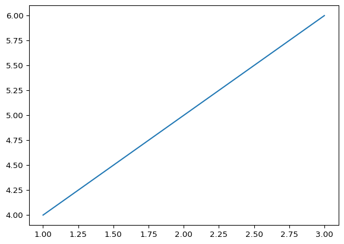

# —


title: “Grouped-query Attention” author: “Chresten R. Søndergaard”
format: gfm: clean: true jupyter: python3 —

## Introduction

This is a sample plot for our product demo.

``` python
import matplotlib.pyplot as plt
plt.plot([1, 2, 3], [4, 5, 6])
plt.show()
```

<div id="fig-gqa-attention-weights">



Figure 1: Visualization of Grouped-query Attention weights.

</div>
